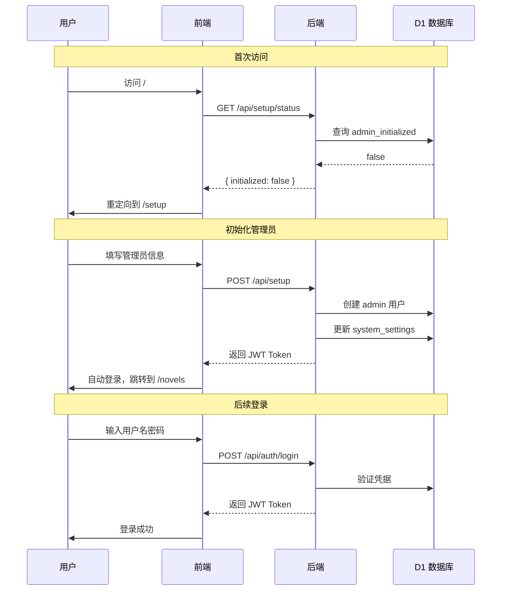

# NovelForge · AI 驱动的智能小说创作平台

<div align="center">


</div>

> 基于 Cloudflare 边缘平台的下一代智能小说创作工具，集成用户系统、AI 创作工坊、RAG 增强生成、多模态设计和多格式导出。

---

## 🌟 核心特性

### Phase 1 · 基础创作 ✅
- **大纲管理** - 树形结构的大纲编辑器，支持拖拽排序和多层级组织
- **章节编辑** - 基于 Novel.js 的富文本编辑器，自动保存功能
- **AI 生成** - SSE 流式输出，实时看到 AI 创作过程
- **阅读器** - 自定义字体、主题、行高的专注阅读模式
- **模型配置** - 支持 20+ 主流 AI 提供商

### Phase 2 · 智能增强 ✅
- **RAG 检索增强** - 基于 Vectorize 的语义检索，自动组装相关上下文
- **Agent 系统** - ReAct 模式的智能 Agent，支持工具调用
- **上下文预览** - 透明展示 AI 生成时使用的参考资料
- **自动摘要** - 章节生成后自动生成内容摘要
- **智能向量化** - 大纲和摘要自动索引到向量数据库

### Phase 3 · 多模态补完 ✅
- **角色图片上传** - R2 对象存储 + 拖拽上传
- **AI 视觉分析** - LLaVA 视觉模型自动生成角色描述
- **多格式导出** - 支持 Markdown/TXT/EPUB/ZIP 多种格式
- **卷范围选择** - 按卷导出部分章节内容

### Phase 4 · 创作辅助系统 ✅
- **伏笔管理** - 自动提取伏笔、状态追踪、AI 检测收尾
- **创作规则** - 定义写作风格、节奏、禁忌等规则
- **总纲管理** - 版本化总纲、替代多层大纲结构
- **小说设定** - 统一管理世界观、境界体系、势力、地理等
- **境界追踪** - 自动检测角色境界突破、记录成长历程
- **内容搜索** - 章节内容关键词搜索与预览
- **MCP 集成** - Claude Desktop 直接访问小说数据

### Phase 5 · 用户系统与创作工坊 🚀 (v1.5.0)
- **用户认证系统**
  - JWT Token 认证，安全的会话管理
  - 注册/登录/修改密码/删除账号
  - 邀请码注册机制（可选）
  - 管理员权限控制
  - 系统初始化向导

- **AI 创意工坊** 🎨
  - 多阶段对话式创作引擎
  - 概念构思 → 世界观构建 → 角色设计 → 卷纲规划
  - SSE 流式 AI 对话，实时预览提取的结构化数据
  - 一键提交生成完整的小说框架（小说+总纲+角色+卷）

- **全新页面布局**
  - 现代化侧边栏导航 + 顶栏设计
  - 完全响应式布局，移动端友好
  - 路由守卫与权限控制
  - 折叠侧边栏 + 移动端抽屉菜单

- **全局模型配置中心**
  - 独立的模型配置管理页面
  - 7 种用途场景配置（章节生成、大纲生成、摘要生成、文本嵌入、视觉理解、智能分析、创作工坊）
  - 支持 20+ AI 提供商（百度文心、腾讯混元、阿里通义、字节豆包、智谱AI、DeepSeek、OpenAI、Anthropic 等）
  - 连接测试功能，实时验证 API 配置
  - 全局/小说级配置优先级管理

---

## 🚀 快速开始

### 环境要求

- Node.js >= 18
- pnpm (推荐) 或 npm
- Cloudflare 账号

### 安装步骤

```bash
# 1. 克隆项目
git clone https://github.com/your-username/novelforge.git
cd novelforge

# 2. 安装依赖
pnpm install

# 3. 登录 Cloudflare
wrangler login

# 4. 创建 D1 数据库
wrangler d1 create novelforge

# 5. 创建 R2 存储桶
wrangler r2 bucket create novelforge-storage

# 6. 配置环境变量（本地开发）
cat > .dev.vars << 'EOF'
VOLCENGINE_API_KEY=你的火山引擎 API Key
ANTHROPIC_API_KEY=你的 Anthropic API Key
OPENAI_API_KEY=你的 OpenAI API Key
EOF

# 7. 初始化数据库（按顺序执行所有迁移）
wrangler d1 migrations apply novelforge --local

# 8. 启动开发服务器
wrangler pages dev --local -- pnpm dev
```

访问 `http://localhost:8788` ，首次访问将进入**系统初始化向导**创建管理员账号。

---

## 📚 文档导航

| 文档 | 描述 |
|------|------|
| [架构设计](./docs/ARCHITECTURE.md) | 系统架构、技术选型、数据流设计 |
| [部署指南](./docs/DEPLOYMENT.md) | 生产环境部署、CI/CD 配置、环境变量 |
| [API 参考](./docs/API.md) | 完整的 REST API 文档 |
| [MCP 配置](./docs/MCP-SETUP.md) | Claude Desktop 集成配置指南 |
| [CHANGELOG](./CHANGELOG.md) | 版本更新记录 |

---

## 🛠 技术栈

### 前端
- **框架**: React 19 + TypeScript 6.0
- **构建**: Vite 8
- **路由**: React Router v7 (嵌套路由 + 布局路由)
- **状态管理**: Zustand 5 + TanStack Query 5.99
- **UI 组件**: shadcn/ui (Radix UI)
- **样式**: Tailwind CSS 3.4
- **编辑器**: Novel.js (Tiptap 封装)
- **图标**: Lucide React
- **表单**: React Hook Form + Zod 验证

### 后端
- **运行时**: Cloudflare Pages Functions
- **框架**: Hono v4.12
- **ORM**: Drizzle ORM 0.45
- **验证**: Zod 4.3 + @hono/zod-validator
- **认证**: 自实现 JWT (HS256)

### 基础设施
- **数据库**: Cloudflare D1 (SQLite)
- **存储**: Cloudflare R2
- **AI**: Workers AI / 外部 API
- **向量**: Cloudflare Vectorize (768 维中文向量)
- **部署**: Cloudflare Pages

---

## 📊 系统架构

```
┌─────────────────────────────────────────────────────────────┐
│                      Cloudflare Pages                        │
├─────────────────────────────────────────────────────────────┤
│  ┌──────────────┐         ┌──────────────────────────────┐  │
│  │   React App  │◄───────►│   Functions /api/[[route]]   │  │
│  │  (dist/)     │         │        (Hono App)            │  │
│  └──────────────┘         └──────────────────────────────┘  │
└─────────────────────────────────────────────────────────────┘
                            │           │
              ┌─────────────┘           └─────────────┐
              │                                       │
      ┌───────▼────────┐                     ┌────────▼───────┐
      │   D1 Database │                     │    R2 Bucket   │
│  (users, novels,  │                     │  (images, ... )│
│   chapters, ...) │                     └────────────────┘
└────────────────┘                             │
        │                               ┌───────▼────────┐
        │                               │   Vectorize    │
        ▼                               │ (embeddings)   │
┌──────────────────┐                     └────────────────┘
│  External LLM   │
│  APIs (20+)     │
└──────────────────┘
```

详细架构图见 [docs/ARCHITECTURE.md](./docs/ARCHITECTURE.md)

---

## 👤 用户系统

### 认证流程



### 功能特性

| 功能 | 说明 |
|------|------|
| **JWT 认证** | HS256 签名，7 天有效期 |
| **密码安全** | PBKDF2 + SHA-256, 100,000 次迭代 |
| **注册控制** | 管理员可开关注册功能 |
| **邀请码** | 可选的邀请码注册机制 |
| **角色权限** | admin / user 两级权限 |
| **账号管理** | 修改密码、删除账号 |

---

## 🎨 AI 创意工坊

### 创作流程

创意工坊采用**分阶段对话式**的创作方式，通过多轮对话帮助作者完善创意：

```
┌─────────────────────────────────────────────────────────────┐
│                    AI 创意工坊工作流                          │
├─────────────────────────────────────────────────────────────┤
│                                                             │
│  ┌──────────┐    ┌──────────┐    ┌──────────┐    ┌────────┐│
│  │ 概念构思  │ →  │世界观构建 │ →  │ 角色设计  │ →  │卷纲规划 ││
│  └──────────┘    └──────────┘    └──────────┘    └────────┘│
│       ↓                ↓               ↓              ↓     │
│  小说类型          地理环境         主角设定       分卷大纲   │
│  核心爽点          力量体系         配角群像       事件线    │
│  目标篇幅          势力格局         反派设计       伏笔安排  │
│                                                             │
│  ┌─────────────────────────────────────────────────────┐   │
│  │              一键提交 → 生成完整小说框架              │   │
│  │  小说记录 + 总纲 + 角色卡片 + 卷结构                 │   │
│  └─────────────────────────────────────────────────────┘   │
│                                                             │
└─────────────────────────────────────────────────────────────┘
```

### 核心能力

- **SSE 流式对话** - 实时看到 AI 思考过程
- **结构化数据提取** - 从对话中自动提取标题、流派、角色、卷纲等
- **实时预览面板** - 右侧面板实时显示已提取的结构化数据
- **阶段切换** - 可在不同创作阶段间自由切换
- **一键提交** - 将确认的数据写入数据库，创建正式的小说项目

---

## 🎯 全局模型配置

### 支持的场景

| 场景 ID | 名称 | 说明 | 推荐模型 |
|---------|------|------|----------|
| `chapter_gen` | 章节生成 | 小说章节内容生成 | GPT-4o / Claude 3.5 |
| `outline_gen` | 大纲生成 | 卷纲、章节大纲生成 | GPT-4o / DeepSeek |
| `summary_gen` | 摘要生成 | 章节摘要、总览生成 | GPT-4o-mini |
| `embedding` | 文本嵌入 | 向量嵌入、语义搜索 | BGE Base zh |
| `vision` | 视觉理解 | 图片分析、OCR识别 | LLaVA 1.5 |
| `analysis` | 智能分析 | 一致性检查、伏笔检测等 | GPT-4o |
| `workshop` | 创作工坊 | AI 创作助手对话 | Claude 3 / GPT-4 |

### 支持的提供商（20+）

国内厂商：
- 百度文心一言、腾讯混元、阿里通义千问、字节火山引擎（豆包）
- 智谱AI、MiniMax、月之暗面（Kimi）、硅基流动

国际厂商：
- OpenAI、Anthropic（Claude）、Google Gemini
- Mistral AI、xAI Grok、Groq、Perplexity

其他：
- OpenRouter（统一接口）、NVIDIA、模力方舟、魔搭社区
- 自定义 OpenAI 兼容接口

### 配置优先级

```
小说级配置 > 全局配置 > 默认值
```

---

## 🔧 核心服务模块

### `/server/services/llm.ts`
统一 LLM 调用层，支持 20+ 提供商，提供流式和非流式生成接口。

### `/server/services/agent.ts`
基于 ReAct 模式的智能 Agent，负责章节生成的完整流程：上下文组装 → LLM 调用 → 工具调用 → 摘要生成。

### `/server/services/contextBuilder.ts`
RAG 上下文组装器，强制注入关键信息（大纲、上一章摘要、主角卡片）+ 语义检索相关片段。

### `/server/services/embedding.ts`
文本向量化服务，使用 `@cf/baai/bge-base-zh-v1.5` 模型（768 维中文向量）。

### `/server/services/vision.ts`
视觉分析服务，使用 LLaVA 模型分析角色图片，自动生成外貌描述和性格标签。

### `/server/services/export.ts`
多格式导出服务，支持 MD/TXT/EPUB/ZIP，包含 HTML→Markdown 转换和目录生成。

### `/server/services/workshop.ts`
创意工坊服务层，实现多阶段对话式创作引擎，包含：
- 分阶段 Prompt 体系（概念/世界观/角色/卷纲）
- SSE 流式消息处理
- 结构化数据提取与提交

### `/server/lib/auth.ts`
认证与安全模块，提供：
- PBKDF2 密码哈希（100,000 次迭代）
- JWT Token 生成与验证（HS256）
- 认证中间件（JWT / Admin 权限）

---

## 📦 项目结构

```
novelforge/
├── src/                          # 前端代码
│   ├── components/
│   │   ├── ui/                   # shadcn 组件
│   │   ├── layout/               # 布局组件 (v1.5 新增)
│   │   │   ├── AppLayout.tsx     # 三栏布局
│   │   │   ├── MainLayout.tsx    # 主布局 (侧边栏+顶栏+内容)
│   │   │   ├── Sidebar.tsx       # 工作区侧边栏
│   │   │   └── WorkspaceHeader.tsx
│   │   ├── model/                # 模型配置组件 (v1.5 新增)
│   │   │   └── ModelConfig.tsx
│   │   ├── novel/                # 小说相关组件
│   │   ├── outline/              # 大纲组件
│   │   ├── chapter/              # 章节编辑器
│   │   ├── generate/             # AI 生成面板
│   │   ├── character/            # 角色管理
│   │   └── export/               # 导出对话框
│   ├── pages/                    # 页面组件
│   │   ├── LoginPage.tsx         # 登录页 (v1.5 新增)
│   │   ├── RegisterPage.tsx      # 注册页 (v1.5 新增)
│   │   ├── AccountPage.tsx       # 账号设置页 (v1.5 新增)
│   │   ├── ModelConfigPage.tsx   # 模型配置页 (v1.5 新增)
│   │   ├── SetupPage.tsx         # 系统初始化页 (v1.5 新增)
│   │   ├── WorkshopPage.tsx      # 创意工坊页 (v1.5 新增)
│   │   ├── NovelsPage.tsx        # 小说列表页
│   │   ├── WorkspacePage.tsx     # 工作区页面
│   │   └── ReaderPage.tsx        # 阅读器页面
│   ├── store/
│   │   └── authStore.ts          # 认证状态管理 (v1.5 新增)
│   ├── lib/
│   │   ├── api.ts                # API 封装
│   │   ├── providers.ts          # AI 提供商配置 (v1.5 更新)
│   │   └── types.ts              # 类型定义
│   ├── App.tsx                   # 应用根组件 (含路由和守卫)
│   └── main.tsx
│
├── server/                       # 后端代码
│   ├── index.ts                  # Hono app 入口
│   ├── routes/
│   │   ├── auth.ts               # 认证路由 (v1.5 新增)
│   │   ├── invite-codes.ts       # 邀请码路由 (v1.5 新增)
│   │   ├── setup.ts              # 系统初始化路由 (v1.5 新增)
│   │   ├── system-settings.ts    # 系统设置路由 (v1.5 新增)
│   │   ├── workshop.ts           # 创意工坊路由 (v1.5 新增)
│   │   ├── novels.ts             # 小说管理
│   │   ├── chapters.ts           # 章节管理
│   │   ├── characters.ts         # 角色管理
│   │   ├── generate.ts           # AI 生成
│   │   ├── settings.ts           # 模型配置
│   │   └── ...                   # 其他路由
│   ├── services/
│   │   ├── llm.ts               # LLM 服务
│   │   ├── agent.ts             # Agent 系统
│   │   ├── contextBuilder.ts    # 上下文组装
│   │   ├── embedding.ts         # 向量化
│   │   ├── vision.ts            # 视觉分析
│   │   ├── export.ts            # 导出服务
│   │   ├── workshop.ts          # 创意工坊服务 (v1.5 新增)
│   │   ├── foreshadowing.ts     # 伏笔追踪
│   │   └── powerLevel.ts        # 境界追踪
│   ├── lib/
│   │   ├── auth.ts              # 认证模块 (v1.5 新增)
│   │   └── types.ts             # 类型定义
│   └── db/
│       ├── schema.ts            # 数据库 Schema
│       └── migrations/          # 数据库迁移
│           ├── 0001_init.sql
│           ├── 0002_add_workshop_sessions.sql
│           ├── 0003_p0_fixes.sql
│           └── 0004_auth_system.sql  # v1.5 新增
│
├── functions/                    # Pages Functions
│   └── api/[[route]].ts         # 通配符路由
│
├── docs/                         # 文档
├── wrangler.toml                 # Cloudflare 配置
├── package.json
└── tsconfig.json
```

---

## 🌍 支持的 LLM 提供商

| 提供商 | 推荐模型 | 适用场景 |
|--------|----------|----------|
| **字节豆包** | doubao-seed-2-pro | 中文创作，性价比高 |
| **Anthropic** | claude-sonnet-4-20250514 | 高质量创作 |
| **OpenAI** | gpt-4o | 通用场景 |
| **DeepSeek** | deepseek-chat | 长文本推理 |
| **智谱AI** | glm-4 | 中文理解 |
| **阿里通义** | qwen-max | 多模态 |
| **百度文心** | ernie-4.0 | 中文生成 |

> 完整提供商列表见 [src/lib/providers.ts](src/lib/providers.ts)

---

## 🔐 安全特性

- **JWT 认证** - 无状态 Token，HS256 签名
- **密码哈希** - PBKDF2 + SHA-256，100,000 次迭代
- **输入验证** - Zod 运行时类型检查
- **SQL 注入防护** - Drizzle ORM 参数化查询
- **软删除** - 数据永不物理删除
- **CORS 配置** - 跨域请求控制
- **API Key 保护** - 敏感信息不存明文

---

## 🤝 贡献指南

欢迎提交 Issue 和 Pull Request！

1. Fork 本仓库
2. 创建特性分支 (`git checkout -b feature/AmazingFeature`)
3. 提交更改 (`git commit -m 'Add some AmazingFeature'`)
4. 推送到分支 (`git push origin feature/AmazingFeature`)
5. 开启 Pull Request

---

## 📄 许可证

本项目采用 MIT 许可证。详见 [LICENSE](LICENSE) 文件。

---

## 🔗 相关链接

- [Cloudflare Workers 文档](https://developers.cloudflare.com/workers/)
- [Hono 框架文档](https://hono.dev/)
- [Drizzle ORM 文档](https://orm.drizzle.team/)
- [shadcn/ui 组件库](https://ui.shadcn.com/)
- [Novel 编辑器](https://novel.sh/)
- [TanStack Query](https://tanstack.com/query)
- [Zustand](https://zustand-demo.pmnd.rs/)

---

<div align="center">

**Made with ❤️ by the NovelForge Team · Version 1.5.0**

</div>
