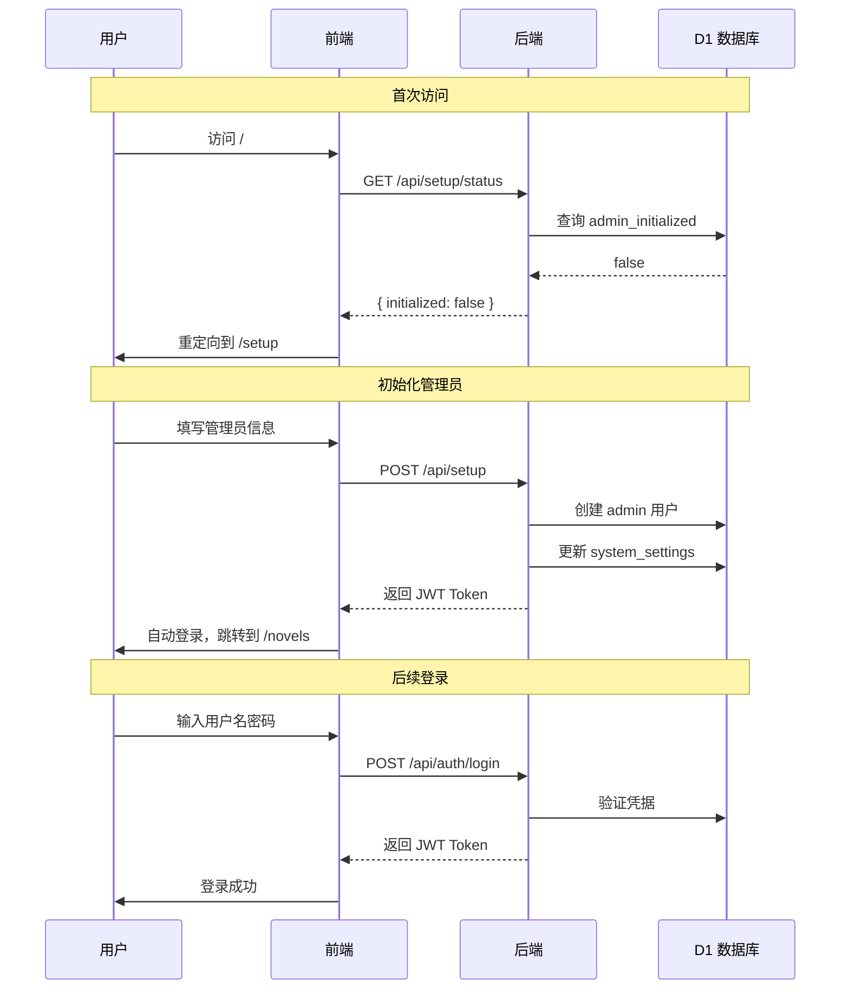

# NovelForge · AI 驱动的智能小说创作平台

<div align="center">


</div>

> 基于 Cloudflare 边缘平台的下一代智能小说创作工具，集成用户系统、AI 创作工坊、RAG 增强生成、多模态设计和多格式导出。

---

## 💡 系统功能

<div align="center">

### 六大核心模块

</div>

| 模块 | 说明 |
|:---:|------|
| **👤 用户系统** | JWT 认证 · 邀请码 · 权限管理 · 系统初始化 |
| **🎨 创意工坊** | 多阶段对话式创作 · SSE 流式 AI · 一键生成小说框架 |
| **🎯 模型配置** | 20+ 提供商 · 7 种场景 · 连接测试 · 优先级管理 |
| **📖 小说工作区** | 大纲编辑器 · 富文本章节 · AI 流式生成 · 专注阅读器 |
| **🧠 智能增强** | RAG 语义检索 · ReAct Agent · 自动摘要 · 向量索引 |
| **✍️ 创作辅助** | 伏笔追踪 · 写作规则 · 世界观设定 · 境界成长 |

---

## 👤 用户系统

> 安全可靠的用户认证与权限管理体系

### 认证流程



### 功能特性

| 功能 | 说明 |
|------|------|
| **JWT 认证** | HS256 签名，7 天有效期 |
| **密码安全** | PBKDF2 + SHA-256, 100,000 次迭代 |
| **注册控制** | 管理员可开关注册功能 |
| **邀请码** | 可选的邀请码注册机制 |
| **角色权限** | admin / user 两级权限 |
| **账号管理** | 修改密码、删除账号 |
| **初始化向导** | 首次部署引导创建管理员 |

---

## 🎨 AI 创意工坊

> 从零开始构建完整小说框架的 AI 对话式创作引擎

### 创作流程

```
┌─────────────────────────────────────────────────────────────┐
│                    AI 创意工坊工作流                          │
├─────────────────────────────────────────────────────────────┤
│                                                             │
│  ┌──────────┐    ┌──────────┐    ┌──────────┐    ┌────────┐│
│  │ 概念构思  │ →  │世界观构建 │ →  │ 角色设计  │ →  │卷纲规划 ││
│  └──────────┘    └──────────┘    └──────────┘    └────────┘│
│       ↓                ↓               ↓              ↓     │
│  小说类型          地理环境         主角设定       分卷大纲   │
│  核心爽点          力量体系         配角群像       事件线    │
│  目标篇幅          势力格局         反派设计       伏笔安排  │
│                                                             │
│  ┌─────────────────────────────────────────────────────┐   │
│  │              一键提交 → 生成完整小说框架              │   │
│  │  小说记录 + 总纲 + 角色卡片 + 卷结构                 │   │
│  └─────────────────────────────────────────────────────┘   │
│                                                             │
└─────────────────────────────────────────────────────────────┘
```

### 核心能力

- **SSE 流式对话** - 实时看到 AI 思考过程
- **结构化数据提取** - 从对话中自动提取标题、流派、角色、卷纲等
- **实时预览面板** - 右侧面板实时显示已提取的结构化数据
- **阶段切换** - 可在不同创作阶段间自由切换
- **一键提交** - 将确认的数据写入数据库，创建正式的小说项目

---

## 🎯 全局模型配置

> 统一管理 20+ AI 提供商的模型配置中心

### 支持的场景

| 场景 ID | 名称 | 说明 |
|---------|------|------|
| `chapter_gen` | 章节生成 | 小说章节内容生成、流式输出 |
| `auto_summary` | 自动摘要 | 章节生成后自动提取摘要 |
| `summary_gen` | 摘要生成 | 章节摘要、总览生成 |
| `foreshadowing_extraction` | 伏笔提取 | 从章节内容中提取伏笔 |
| `power_level_detection` | 境界检测 | 自动检测角色境界突破事件 |
| `semantic_search` | 语义搜索 | 基于向量的相似度搜索 |
| `workshop` | 创作工坊 | AI 创作助手对话（含concept/world/character/volume_outline等子阶段） |

### 支持的提供商（20+）

国内厂商：百度文心、腾讯混元、阿里通义千问、火山引擎(豆包)、智谱AI、MiniMax、月之暗面（Kimi）、硅基流动

国际厂商：OpenAI、Anthropic(Claude)、Google Gemini、Mistral AI、xAI Grok、Groq、Perplexity

其他：OpenRouter、NVIDIA、模力方舟、魔搭社区、自定义 OpenAI 兼容接口

### 配置优先级

```
小说级配置 > 全局配置 > 默认值
```

---

## 📖 小说工作区

> 从大纲到成稿的全流程创作环境

### 核心功能

#### 📝 大纲管理
- **树形编辑器** - 支持拖拽排序和多层级组织
- **节点类型** - 世界观 / 卷 / 章节 / 自定义节点
- **实时同步** - 大纲变更自动关联到章节

#### ✏️ 章节编辑
- **富文本编辑器** - 基于 Novel.js (Tiptap)，支持 Markdown 快捷输入
- **自动保存** - 防抖 1.5s，防止内容丢失
- **字数统计** - 实时显示当前字数

#### 🤖 AI 生成
- **SSE 流式输出** - 实时看到 AI 创作过程
- **上下文组装** - 自动注入大纲、摘要、角色信息
- **多轮对话** - 支持 ReAct 模式的工具调用

#### 📚 专注阅读
- **多主题** - 白色 / 暗色 / 护眼模式
- **字体调节** - 自定义字体大小和行高
- **章节导航** - 快速跳转任意章节

---

## 🧠 智能增强系统

> RAG 检索增强 + Agent 智能代理

### RAG 语义检索

```
Token 预算分配:
Total: 128,000 tokens
├─ System Prompt:     2,000
├─ Mandatory (强制):  约 50,000+
│  ├─ 总纲内容（最多12,000字）
│  ├─ 上一章摘要
│  ├─ 当前卷概要
│  ├─ 主角角色卡
│  └─ 世界设定（RAG+DB）
└─ RAG (语义检索):    动态分配
   └─ Vectorize Top-K 相似片段
```

### Agent 系统 (ReAct)

1. **接收任务** → 解析章节 ID 和生成需求
2. **构建上下文** → ContextBuilder 组装相关信息
3. **调用 LLM** → 流式生成 + 工具调用循环
4. **工具执行** → queryOutline / searchSemantic / ...
5. **后处理** → 自动生成摘要 + 向量化索引

### 能力清单

| 能力 | 说明 |
|------|------|
| **向量嵌入** | @cf/baai/bge-m3 (1024 维中文) |
| **语义检索** | Vectorize 相似度搜索，Top-K 结果 |
| **自动摘要** | 章节生成后自动提取摘要 |
| **智能向量化** | 大纲、摘要、角色自动索引 |

---

## ✍️ 创作辅助工具

> 让长篇小说创作更有条理的专业辅助功能

### 功能矩阵

| 功能 | 核心能力 |
|------|----------|
| **🪝 伏笔管理** | 自动提取伏笔 · 状态追踪(开放/收尾/放弃) · 重要性分级 · 健康检查 · 智能推荐 |
| **📜 创作规则** | 定义写作风格/节奏/禁忌 · 优先级管理(1-5) · 分类管理(7大类) · 启用/禁用切换 |
| **🌍 小说设定** | 世界观/境界体系/势力/地理/宝物功法 · 树形结构 · 关联关系 · 向量化检索 |
| **⚡ 境界追踪** | 自动检测突破事件 · 角色成长历程 · 突破历史记录 · 多体系支持 · 校验与建议 |
| **🔍 内容搜索** | 章节关键词搜索 · 结果高亮预览 · 限定范围搜索 |
| **📦 多格式导出** | Markdown/TXT/EPUB/HTML/ZIP · 卷范围选择 · 目录生成 · 实体树数据包 |
| **🔗 MCP 集成** | Claude Desktop 直接访问 · 小说数据查询 · 语义搜索 · 14个工具函数 |
| **🖥️ AI 监控中心** | 向量索引统计 · 生成日志 · 上下文诊断 · 服务状态检查 |
| **🌳 实体树** | 树形结构展示 · 快速定位章节 · 元数据展示 |
| **🗑️ 回收站** | 软删除数据查看 · 按表分类 · 单条/批量永久删除 |
| **🛡️ 质量检查** | 角色一致性检查 · 章节连贯性检查 · 卷进度检查 · 综合评分 · 自动修复 |
| **⚡ 队列任务** | 异步索引重建 · 后台任务处理 · 任务日志追踪 |
| **🪄 数据导入** | AI智能格式识别 · JSON/TXT/MD支持 · 7种模块 · 3种导入模式 · 批量处理 |
| **📥 工坊导入** | 结构化数据导入 · 批量创建 · 数据验证 |
| **🪝 伏笔进度** | 伏笔收尾进度追踪 · 多章节分布 · 状态可视化 · 沉寂检测 |
| **📊 批量生成** | 批量章节生成 · 任务暂停/恢复/取消 · 进度追踪 · 后台异步处理 |
| **🏆 质量评分** | 多维度质量评估(情节/连贯/伏笔/节奏/流畅) · 评分历史 · 质量趋势分析 |
| **💡 上一章建议** | 基于上一章续写建议 · 文风延续 · 剧情衔接优化 |
| **📈 卷完成检测** | 卷完成度评估 · 字数/章节数进度 · 完成百分比计算 |
| **🗺️ 情节图谱** | 角色关系可视化 · 势力关系图 · 情节发展追踪 · 交互式探索 |
| **🎨 封面生成** | AI智能生成小说封面 · 多风格支持 · 自定义上传 · R2存储 |

---

## 🚀 快速开始

### 环境要求

- Node.js >= 20 (v2.2.0+)
- pnpm (推荐) 或 npm
- Cloudflare 账号

### 安装步骤

```bash
# 1. 克隆项目
git clone https://github.com/your-username/novelforge.git
cd novelforge

# 2. 安装依赖
pnpm install

# 3. 登录 Cloudflare
wrangler login

# 4. 创建 D1 数据库
wrangler d1 create novelforge

# 5. 创建 R2 存储桶
wrangler r2 bucket create novelforge-storage

# 6. 配置环境变量（本地开发）
cat > .dev.vars << 'EOF'
VOLCENGINE_API_KEY=你的火山引擎 API Key
ANTHROPIC_API_KEY=你的 Anthropic API Key
OPENAI_API_KEY=你的 OpenAI API Key
EOF

# 7. 初始化数据库（按顺序执行所有迁移）
wrangler d1 migrations apply novelforge --local

# 8. 启动开发服务器
wrangler pages dev --local -- pnpm dev
```

访问 `http://localhost:8788` ，首次访问将进入**系统初始化向导**创建管理员账号。

---

## 📚 文档导航

| 文档 | 描述 |
|------|------|
| [架构设计](./docs/ARCHITECTURE.md) | 系统架构、技术选型、数据流设计 |
| [部署指南](./docs/DEPLOYMENT.md) | 生产环境部署、CI/CD 配置、环境变量 |
| [API 参考](./docs/API.md) | 完整的 REST API 文档 |
| [MCP 配置](./docs/MCP-SETUP.md) | Claude Desktop 集成配置指南 |
| [章节生成上下文指南](./docs/CHAPTER-GENERATION-CONTEXT-GUIDE.md) | 上下文构建完整执行逻辑 |
| [模型使用指南](./docs/MODEL-USAGE-GUIDE.md) | 模型配置与使用详解 |
| [创作工坊指南](./docs/WORKSHOP-EXECUTION-GUIDE.md) | 创作工坊完整执行逻辑 |
| [CHANGELOG](./CHANGELOG.md) | 版本更新记录 |

---

## 🛠 技术栈

### 前端
- **框架**: React 19 + TypeScript 6.0
- **构建**: Vite 8
- **路由**: React Router v7 (嵌套路由 + 布局路由)
- **状态管理**: Zustand 5 + TanStack Query 5.99
- **UI 组件**: shadcn/ui (Radix UI)
- **样式**: Tailwind CSS 3.4
- **编辑器**: Novel.js (Tiptap 封装)
- **图标**: Lucide React
- **表单**: React Hook Form + Zod 验证

### 后端
- **运行时**: Cloudflare Pages Functions
- **框架**: Hono v4
- **ORM**: Drizzle ORM 0.45
- **验证**: Zod 4 + @hono/zod-validator
- **认证**: 自实现 JWT (HS256)

### 基础设施
- **数据库**: Cloudflare D1 (SQLite)
- **存储**: Cloudflare R2
- **AI**: Workers AI / 外部 API
- **向量**: Cloudflare Vectorize (1024 维中文向量)
- **部署**: Cloudflare Pages

---

## 📊 系统架构

```
┌─────────────────────────────────────────────────────────────┐
│                      Cloudflare Pages                        │
├─────────────────────────────────────────────────────────────┤
│  ┌──────────────┐         ┌──────────────────────────────┐  │
│  │   React App  │◄───────►│   Functions /api/[[route]]   │  │
│  │  (dist/)     │         │        (Hono App)            │  │
│  └──────────────┘         └──────────────────────────────┘  │
└─────────────────────────────────────────────────────────────┘
                            │           │
              ┌─────────────┘           └─────────────┐
              │                                       │
      ┌───────▼────────┐                     ┌────────▼───────┐
      │   D1 Database │                     │    R2 Bucket   │
│  (users, novels,  │                     │  (images, ... )│
│   chapters, ...) │                     └────────────────┘
└────────────────┘                             │
        │                               ┌───────▼────────┐
        │                               │   Vectorize    │
        ▼                               │ (embeddings)   │
┌──────────────────┐                     └────────────────┘
│  External LLM   │
│  APIs (20+)     │
└──────────────────┘
```

详细架构图见 [docs/ARCHITECTURE.md](./docs/ARCHITECTURE.md)

---

## 🔧 核心服务模块

### `/server/services/llm.ts`
统一 LLM 调用层，支持 20+ 提供商，提供流式和非流式生成接口。

### `/server/services/agent/index.ts`
基于 ReAct 模式的智能 Agent，负责章节生成的完整流程。包含以下子模块：
- `executor.ts` - 执行器（协调各模块）
- `reactLoop.ts` - ReAct 循环（思考-行动循环）
- `generation.ts` - 生成逻辑（主控流程）
- `tools.ts` - 工具定义（queryOutline, searchSemantic 等）
- `messages.ts` - 消息构建（System/User/Tool 消息）
- `summarizer.ts` - 摘要生成（章节摘要提取）
- `coherence.ts` - 连贯性检查
- `consistency.ts` - 一致性检查
- `volumeProgress.ts` - 卷进度检查

### `/server/services/contextBuilder.ts`
RAG 上下文组装器，强制注入关键信息（大纲、上一章摘要、主角卡片）+ 语义检索相关片段。

### `/server/services/embedding.ts`
文本向量化服务，使用 `@cf/baai/bge-base-zh-v1.5` 模型（1024 维中文向量）。

### `/server/services/export.ts`
多格式导出服务，支持 MD/TXT/EPUB/ZIP，包含 HTML→Markdown 转换和目录生成。

### `/server/services/workshop.ts`
创意工坊服务层，实现多阶段对话式创作引擎，包含：
- 分阶段 Prompt 体系（概念/世界观/角色/卷纲）
- SSE 流式消息处理
- 结构化数据提取与提交

### `/server/services/agent/batchGenerate.ts`
批量章节生成服务（v2.1.0），被 queue-handler 调用，支持后台异步批量生成。

### `/server/services/agent/qualityCheck.ts`
质量评分服务（v2.1.0），基于连贯性检查结果生成多维度质量评分。

### `/server/services/agent/prevChapterAdvice.ts`
上一章建议服务（v2.1.0），生成章节时自动注入文风延续建议。

### `/server/services/agent/volumeCompletion.ts`
卷完成检测服务（v2.1.0），检测卷是否接近完成。

### `/server/services/plotGraph.ts`
情节图谱服务（v2.2.0），构建和管理角色关系图谱、势力关系网络。

### `/server/services/imageGen.ts`
封面生成服务（v2.2.0），AI 智能生成小说封面图片。

### `/server/services/agent/postProcess.ts`
章节后处理服务（v2.2.0），生成后自动执行摘要、伏笔提取、境界检测等任务。

### `/server/lib/auth.ts`
认证与安全模块，提供：
- PBKDF2 密码哈希（100,000 次迭代）
- JWT Token 生成与验证（HS256）
- 认证中间件（JWT / Admin 权限）

---

## 📦 项目结构

```
novelforge/
├── src/                          # 前端代码
│   ├── components/
│   │   ├── ui/                   # shadcn 组件
│   │   ├── AppLayout.tsx         # 应用布局
│   │   ├── MainLayout.tsx        # 主布局
│   │   ├── Sidebar.tsx           # 侧边栏
│   │   ├── WorkspaceHeader.tsx    # 工作区头部
│   │   ├── model/                # 模型配置组件
│   │   ├── novel/                # 小说相关组件
│   │   │   ├── NovelCard.tsx
│   │   │   ├── CreateNovelDialog.tsx
│   │   │   └── EditNovelDialog.tsx
│   │   ├── outline/              # 大纲组件
│   │   │   └── OutlinePanel.tsx
│   │   ├── chapter/              # 章节组件
│   │   │   ├── ChapterList.tsx
│   │   │   ├── ChapterEditor.tsx
│   │   │   └── ChapterSummaryTab.tsx
│   │   ├── volume/               # 卷组件
│   │   │   └── VolumePanel.tsx
│   │   ├── character/            # 角色组件
│   │   │   ├── CharacterList.tsx
│   │   │   └── CharacterImageUpload.tsx
│   │   ├── foreshadowing/        # 伏笔组件
│   │   │   └── ForeshadowingPanel.tsx
│   │   ├── rules/                # 规则组件
│   │   │   └── RulesPanel.tsx
│   │   ├── powerlevel/           # 境界追踪组件
│   │   │   └── PowerLevelPanel.tsx
│   │   ├── novelsetting/         # 小说设定组件
│   │   │   └── NovelSettingsPanel.tsx
│   │   ├── generate/             # AI 生成面板
│   │   │   ├── GeneratePanel.tsx
│   │   │   ├── StreamOutput.tsx
│   │   │   ├── ContextPreview.tsx
│   │   │   └── GenerationLogs.tsx
│   │   ├── generation/           # 批量生成面板 (v2.1.0)
│   │   │   └── BatchGeneratePanel.tsx
│   │   ├── chapter-health/       # 质量检查组件
│   │   │   ├── ChapterCoherenceCheck.tsx
│   │   │   ├── ChapterHealthCheck.tsx
│   │   │   ├── CharacterConsistencyCheck.tsx
│   │   │   ├── CombinedCheck.tsx
│   │   │   ├── VolumeProgressCheck.tsx
│   │   │   └── QualityScoreBadge.tsx (v2.1.0)
│   │   ├── workshop/             # 创作工坊组件 (v1.11.0 重构)
│   │   │   ├── WorkshopSidebar.tsx
│   │   │   ├── ChatInput.tsx
│   │   │   ├── ChatMessageList.tsx
│   │   │   ├── CommitDialog.tsx
│   │   │   ├── PreviewPanel.tsx
│   │   │   ├── PreviewBasicInfo.tsx
│   │   │   ├── PreviewChapters.tsx
│   │   │   ├── PreviewCharacters.tsx
│   │   │   ├── PreviewVolumes.tsx
│   │   │   ├── PreviewWorldSettings.tsx
│   │   │   ├── PreviewWritingRules.tsx
│   │   │   ├── WelcomeView.tsx
│   │   │   ├── WorkshopHeaderActions.tsx
│   │   │   ├── ImportDataDialog.tsx
│   │   │   └── types.ts
│   │   ├── entitytree/           # 实体树面板
│   │   │   └── EntityTreePanel.tsx
│   │   ├── trash/               # 回收站组件
│   │   │   ├── TrashPanel.tsx
│   │   │   └── NovelTrashDialog.tsx
│   │   ├── export/               # 导出组件
│   │   │   └── ExportDialog.tsx
│   │   ├── search/               # 搜索组件
│   │   │   └── SearchBar.tsx
│   │   └── stats/                # 统计组件
│   │       └── WritingStats.tsx
│   ├── pages/                    # 页面组件
│   │   ├── LoginPage.tsx         # 登录页
│   │   ├── RegisterPage.tsx       # 注册页
│   │   ├── AccountPage.tsx       # 账号设置页
│   │   ├── ModelConfigPage.tsx   # 模型配置页
│   │   ├── SetupPage.tsx         # 系统初始化页
│   │   ├── WorkshopPage.tsx      # 创意工坊页
│   │   ├── AiMonitorPage.tsx     # AI监控中心页
│   │   ├── NovelsPage.tsx        # 小说列表页
│   │   ├── WorkspacePage.tsx     # 工作区页面
│   │   └── ReaderPage.tsx        # 阅读器页面
│   ├── store/
│   │   ├── authStore.ts          # 认证状态管理
│   │   ├── novelStore.ts        # 小说状态管理
│   │   └── readerStore.ts       # 阅读器状态管理
│   ├── hooks/
│   │   └── useGenerate.ts        # 生成Hook
│   ├── lib/
│   │   ├── api.ts                # API 封装
│   │   ├── providers.ts          # AI 提供商配置
│   │   ├── types.ts              # 类型定义
│   │   ├── formatContent.ts      # 文本格式化工具
│   │   ├── html-to-markdown.ts   # HTML转Markdown工具
│   │   └── utils.ts             # 通用工具函数
│   ├── App.tsx                   # 应用根组件
│   └── main.tsx
│
├── server/                       # 后端代码
│   ├── index.ts                  # Hono app 入口
│   ├── queue-handler.ts           # 队列任务处理器 (v1.6.0 新增)
│   ├── routes/
│   │   ├── auth.ts               # 认证路由
│   │   ├── invite-codes.ts        # 邀请码路由
│   │   ├── setup.ts              # 系统初始化路由
│   │   ├── system-settings.ts     # 系统设置路由
│   │   ├── workshop.ts           # 创意工坊路由
│   │   ├── workshop-import.ts     # 工坊导入路由 (v1.8.0 新增)
│   │   ├── workshop-format-import.ts # 格式化工坊导入路由 (v1.8.0 新增)
│   │   ├── novels.ts             # 小说管理
│   │   ├── chapters.ts           # 章节管理
│   │   ├── volumes.ts            # 卷管理
│   │   ├── characters.ts         # 角色管理
│   │   ├── foreshadowing.ts      # 伏笔管理
│   │   ├── master-outline.ts     # 总纲管理
│   │   ├── power-level.ts        # 境界追踪路由
│   │   ├── entity-index.ts       # 实体索引路由
│   │   ├── generate.ts           # AI 生成
│   │   ├── batch.ts              # 批量生成 (v2.1.0)
│   │   ├── quality.ts            # 质量评分 (v2.1.0)
│   │   ├── cover.ts              # 封面生成 (v2.2.0)
│   │   ├── graph.ts              # 情节图谱 (v2.2.0)
│   │   ├── settings.ts           # 模型配置
│   │   ├── vectorize.ts          # 向量化索引
│   │   ├── search.ts             # 搜索路由
│   │   ├── writing-rules.ts       # 写作规则路由
│   │   ├── mcp.ts                # MCP 服务路由
│   │   └── export.ts             # 导出路由
│   ├── services/
│   │   ├── llm.ts               # LLM 服务
│   │   ├── agent/               # Agent 系统模块化 (v1.6.0 重构)
│   │   │   ├── index.ts         # 统一导出
│   │   │   ├── batchGenerate.ts # 批量生成 (v2.1.0)
│   │   │   ├── coherence.ts     # 连贯性检查
│   │   │   ├── consistency.ts   # 一致性检查
│   │   │   ├── volumeProgress.ts # 卷进度检查
│   │   │   ├── qualityCheck.ts  # 质量评分 (v2.1.0)
│   │   │   ├── prevChapterAdvice.ts # 上一章建议 (v2.1.0)
│   │   │   ├── volumeCompletion.ts # 卷完成检测 (v2.1.0)
│   │   │   ├── postProcess.ts     # 后处理服务 (v2.2.0)
│   │   │   ├── checkLogService.ts # 检查日志服务
│   │   │   ├── constants.ts     # 常量定义
│   │   │   ├── executor.ts      # 执行器
│   │   │   ├── generation.ts    # 生成逻辑
│   │   │   ├── logging.ts       # 日志记录
│   │   │   ├── messages.ts      # 消息处理
│   │   │   ├── reactLoop.ts     # ReAct循环
│   │   │   ├── summarizer.ts    # 摘要生成
│   │   │   ├── tools.ts         # 工具定义
│   │   │   └── types.ts        # 类型定义
│   │   ├── contextBuilder.ts    # 上下文组装 (v4.0 优化)
│   │   ├── embedding.ts         # 向量化
│   │   ├── export.ts            # 导出服务
│   │   ├── foreshadowing.ts     # 伏笔追踪 (v1.7.0 增强)
│   │   ├── powerLevel.ts        # 境界追踪
│   │   ├── entity-index.ts      # 实体索引
│   │   ├── formatImport.ts      # 格式导入服务 (v1.8.0 新增)
│   │   ├── plotGraph.ts         # 情节图谱 (v2.2.0 新增)
│   │   ├── imageGen.ts          # 封面生成 (v2.2.0 新增)
│   │   └── workshop.ts          # 创意工坊服务
│   ├── lib/
│   │   ├── auth.ts              # 认证模块
│   │   ├── queue.ts             # 队列操作库 (v1.6.0 新增)
│   │   └── types.ts             # 类型定义
│   └── db/
│       ├── schema.ts            # 数据库 Schema
│       └── migrations/          # 数据库迁移
│           └── 0000_schema.sql  # 完整数据库结构（合并所有迁移）
│
├── docs/                         # 文档
│   ├── ARCHITECTURE.md
│   ├── API.md
│   ├── DEPLOYMENT.md
│   ├── MCP-SETUP.md
│   ├── MODEL-USAGE-GUIDE.md
│   ├── WORKSHOP-EXECUTION-GUIDE.md
│   ├── CHAPTER-GENERATION-CONTEXT-GUIDE.md
│   └── NovelForge-开发计划-v2.1-完整版.md
├── wrangler.toml                 # Cloudflare 配置 (v1.6.0 Queue配置)
├── package.json
└── tsconfig.json
```

---

## 🌍 支持的 LLM 提供商

| 提供商 | API ID | 适用场景 |
|--------|--------|----------|
| **火山引擎(豆包)** | volcengine | 中文创作，性价比高 |
| **Anthropic(Claude)** | anthropic | 高质量创作 |
| **OpenAI** | openai | 通用场景 |
| **DeepSeek** | deepseek | 长文本推理 |
| **智谱AI** | zhipu | 中文理解 |
| **阿里通义千问** | aliyun | 多模态 |
| **百度文心一言** | baidu | 中文生成 |

> 完整提供商列表见 [src/lib/providers.ts](src/lib/providers.ts)

---

## 🔐 安全特性

- **JWT 认证** - 无状态 Token，HS256 签名
- **密码哈希** - PBKDF2 + SHA-256，100,000 次迭代
- **输入验证** - Zod 运行时类型检查
- **SQL 注入防护** - Drizzle ORM 参数化查询
- **软删除** - 数据永不物理删除
- **CORS 配置** - 跨域请求控制
- **API Key 保护** - 敏感信息不存明文

---

## 🤝 贡献指南

欢迎提交 Issue 和 Pull Request！

1. Fork 本仓库
2. 创建特性分支 (`git checkout -b feature/AmazingFeature`)
3. 提交更改 (`git commit -m 'Add some AmazingFeature'`)
4. 推送到分支 (`git push origin feature/AmazingFeature`)
5. 开启 Pull Request

---

## 📄 许可证

本项目采用 MIT 许可证。详见 [LICENSE](LICENSE) 文件。

---

## 🔗 相关链接

- [Cloudflare Workers 文档](https://developers.cloudflare.com/workers/)
- [Hono 框架文档](https://hono.dev/)
- [Drizzle ORM 文档](https://orm.drizzle.team/)
- [shadcn/ui 组件库](https://ui.shadcn.com/)
- [Novel 编辑器](https://novel.sh/)
- [TanStack Query](https://tanstack.com/query)
- [Zustand](https://zustand-demo.pmnd.rs/)

---

<div align="center">

**Made with ❤️ by the NovelForge Team · Version 2.2.0**

</div>
