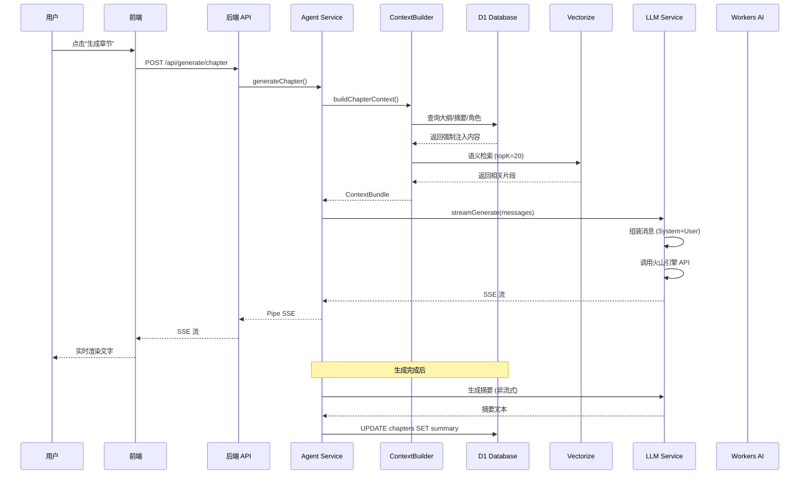

# NovelForge · 系统架构设计

> 本文档详细描述了 NovelForge 的系统架构、技术选型、数据流设计和核心模块实现原理。

---

## 📋 目录

- [总体架构](#总体架构)
- [技术栈详解](#技术栈详解)
- [数据模型设计](#数据模型设计)
- [核心服务模块](#核心服务模块)
- [AI 工作流](#ai-工作流)
- [性能优化策略](#性能优化策略)
- [安全考虑](#安全考虑)

---

## 总体架构

### 架构图

```
┌─────────────────────────────────────────────────────────────────────┐
│                         Client Browser                               │
└─────────────────────────────────────────────────────────────────────┘
                                    │
                                    ▼
┌─────────────────────────────────────────────────────────────────────┐
│                      Cloudflare Pages CDN                            │
│  ┌───────────────────────────────────────────────────────────────┐  │
│  │  Static Assets (dist/)                                         │  │
│  │  - index.html                                                  │  │
│  │  - assets/index-*.js                                           │  │
│  │  - assets/index-*.css                                          │  │
│  └───────────────────────────────────────────────────────────────┘  │
│  ┌───────────────────────────────────────────────────────────────┐  │
│  │  Functions /api/[[route]]                                      │  │
│  │  ┌─────────────────────────────────────────────────────────┐  │  │
│  │  │         Hono Application (server/index.ts)               │  │  │
│  │  │  ┌─────────┐ ┌─────────┐ ┌─────────┐ ┌─────────┐       │  │  │
│  │  │  │ novels  │ │outlines │ │chapters │ │characters│      │  │  │
│  │  │  └─────────┘ └─────────┘ └─────────┘ └─────────┘       │  │  │
│  │  │  ┌─────────┐ ┌──────────┐ ┌─────────┐ ┌──────────┐    │  │  │
│  │  │  │generate │ │  export  │ │settings │ │  health  │    │  │  │
│  │  │  └─────────┘ └──────────┘ └─────────┘ └──────────┘    │  │  │
│  │  └─────────────────────────────────────────────────────────┘  │  │
│  └───────────────────────────────────────────────────────────────┘  │
└─────────────────────────────────────────────────────────────────────┘
                    │                     │                    │
        ┌───────────┘                     │                    └──────┐
        │                                 │                           │
┌───────▼──────────┐            ┌────────▼────────┐        ┌─────────▼──────┐
│   D1 Database    │            │  Vectorize      │        │   R2 Bucket    │
│  (SQLite Edge)   │            │ (Vector Search) │        │  (Object Store)│
├──────────────────┤            ├─────────────────┤        ├────────────────┤
│ - novels         │            │ - embeddings    │        │ - character    │
│ - outlines       │            │   (768 dim)     │        │   images       │
│ - chapters       │            │ - metadata      │        │ - exports      │
│ - characters     │            │   indexing      │        │ - covers       │
│ - volumes        │            └─────────────────┘        └────────────────┘
│ - model_configs  │
│ - generation_... │
└──────────────────┘
        │
        ▼
┌──────────────────┐
│  Workers AI      │
│  (Edge Inference)│
├──────────────────┤
│ - BGE Base zh    │ (Embedding)
│ - LLaVA 1.5 7B   │ (Vision)
│ - Doubao/Claude  │ (LLM via API)
└──────────────────┘
```

### 架构特点

1. **边缘优先 (Edge-First)**
   - 所有计算都在 Cloudflare 边缘网络运行
   - 全球 300+ 数据中心自动路由，延迟最低化
   - 无服务器冷启动问题

2. **单包架构 (Monorepo-free)**
   - 前端和后端在同一仓库
   - `functions/` 目录作为唯一后端入口
   - `server/` 目录存放业务逻辑，被 functions 引用

3. **类型安全 (Type-Safe)**
   - TypeScript 端到端类型覆盖
   - Drizzle ORM 提供数据库类型安全
   - Zod 运行时验证

---

## 技术栈详解

### 前端技术栈

| 技术 | 版本 | 用途 | 选择理由 |
|------|------|------|----------|
| **React** | 18.3 | UI 框架 | 成熟的组件生态，Hooks 模式 |
| **TypeScript** | 5.x | 类型系统 | 端到端类型安全 |
| **Vite** | 5 | 构建工具 | 极速 HMR，生产优化 |
| **React Router** | 6 | 路由 | 声明式路由，嵌套布局 |
| **Zustand** | 4 | 状态管理 | 轻量级，无需 Provider 嵌套 |
| **TanStack Query** | 5 | 服务端状态 | 缓存、重试、乐观更新 |
| **shadcn/ui** | - | UI 组件 | 可定制，基于 Radix |
| **Tailwind CSS** | 3 | 样式 | 原子化 CSS，开发效率 |
| **Novel.js** | 0.5 | 编辑器 | Tiptap 封装，AI 友好 |
| **Lucide React** | - | 图标 | 统一图标库，Tree-shaking |

### 后端技术栈

| 技术 | 版本 | 用途 | 选择理由 |
|------|------|------|----------|
| **Hono** | 4 | Web 框架 | 超轻量，Cloudflare 原生 |
| **Drizzle ORM** | 0.30 | ORM | SQL-like 语法，Type-safe |
| **Zod** | 3.22 | 验证 | 运行时类型安全 |
| **@hono/zod-validator** | 0.2 | 验证中间件 | Hono + Zod 集成 |

### 基础设施

| 服务 | 用途 | 配额 | 成本 |
|------|------|------|------|
| **Cloudflare Pages** | 静态托管 + Functions | 100GB/月带宽 | 免费 |
| **D1** | 关系数据库 | 100 万读/日，10 万写/日 | 免费 |
| **R2** | 对象存储 | 10GB 存储，100 万 A 类操作 | 免费 |
| **Vectorize** | 向量搜索 | 1000 索引/账户 | 免费 |
| **Workers AI** | AI 推理 | 10 万 秒/日 | 免费 |

---

## 数据模型设计

### ER 图

```
┌─────────────┐       ┌──────────────┐       ┌─────────────┐
│   novels    │1─────n│   volumes    │1─────n│   chapters  │
├─────────────┤       ├──────────────┤       ├─────────────┤
│ id          │       │ id           │       │ id          │
│ title       │       │ novelId      │◄──────┤ novelId     │
│ description │       │ outlineId    │       │ volumeId    │
│ genre       │       │ title        │       │ outlineId   │
│ status      │       │ sortOrder    │       │ title       │
│ coverR2Key  │       │ summary      │       │ content     │
│ wordCount   │       │ wordCount    │       │ summary     │
│ chapterCount│       │ status       │       │ modelUsed   │
│ created_at  │       │ created_at   │       │ tokens...   │
│ updated_at  │       │ updated_at   │       │ created_at  │
│ deletedAt   │       └──────────────┘       │ updated_at  │
└─────────────┘                              │ deletedAt   │
     │                                       └─────────────┘
     │                                                   │
     │ n                                                 │ n
     │                        ┌──────────────┐           │
     └───────────────────────►│  characters  │           │
                              ├──────────────┤           │
                              │ id           │           │
                              │ novelId      │◄──────────┘
                              │ name         │
                              │ aliases      │
                              │ role         │
                              │ description  │
                              │ imageR2Key   │
                              │ attributes   │
                              │ vectorId     │
                              │ created_at   │
                              │ deletedAt    │
                              └──────────────┘
                                   ▲
                                   │
     ┌─────────────────────────────┘
     │ n
     │
┌────┴────────────┐       ┌────────────────┐
│   outlines      │       │  model_configs │
├─────────────────┤       ├────────────────┤
│ id              │       │ id             │
│ novelId         │       │ novelId        │
│ parentId        │       │ scope          │
│ type            │       │ stage          │
│ title           │       │ provider       │
│ content         │       │ modelId        │
│ sortOrder       │       │ apiBase        │
│ vectorId        │       │ apiKeyEnv      │
│ indexedAt       │       │ params         │
│ created_at      │       │ isActive       │
│ updated_at      │       │ created_at     │
│ deletedAt       │       │ updated_at     │
└─────────────────┘       └────────────────┘
```

### 核心表说明

#### `novels` - 小说主表
```sql
CREATE TABLE novels (
  id TEXT PRIMARY KEY,           -- UUID (前 16 字符)
  title TEXT NOT NULL,           -- 标题
  description TEXT,              -- 简介
  genre TEXT,                    -- 类型：玄幻/仙侠/都市...
  status TEXT DEFAULT 'draft',   -- draft/writing/completed/archived
  cover_r2_key TEXT,             -- 封面图片 R2 路径
  word_count INTEGER DEFAULT 0,  -- 总字数
  chapter_count INTEGER DEFAULT 0,-- 章节数
  created_at INTEGER,            -- Unix 时间戳
  updated_at INTEGER,
  deletedAt INTEGER              -- 软删除标记
);
```

#### `outlines` - 大纲节点
```sql
CREATE TABLE outlines (
  id TEXT PRIMARY KEY,
  novel_id TEXT NOT NULL,
  parent_id TEXT,                -- 父节点 ID（树形结构）
  type TEXT NOT NULL,            -- world_setting/volume/chapter_outline/custom
  title TEXT NOT NULL,
  content TEXT,                  -- 大纲详细内容
  sort_order INTEGER DEFAULT 0,  -- 排序权重
  vector_id TEXT,                -- Vectorize 索引 ID
  indexed_at INTEGER,            -- 向量化时间
  created_at INTEGER,
  updated_at INTEGER,
  deletedAt INTEGER
);
```

#### `chapters` - 章节
```sql
CREATE TABLE chapters (
  id TEXT PRIMARY KEY,
  novel_id TEXT NOT NULL,
  volume_id TEXT,                -- 所属卷
  outline_id TEXT,               -- 关联大纲
  title TEXT NOT NULL,
  sort_order INTEGER DEFAULT 0,
  content TEXT,                  -- 正文内容 (HTML)
  word_count INTEGER DEFAULT 0,
  status TEXT DEFAULT 'draft',   -- draft/generated/revised
  model_used TEXT,               -- 使用的模型 ID
  prompt_tokens INTEGER,         -- Prompt token 数
  completion_tokens INTEGER,     -- Completion token 数
  generation_time INTEGER,       -- 生成耗时 (ms)
  summary TEXT,                  -- 自动生成摘要
  summary_at INTEGER,            -- 摘要生成时间
  vector_id TEXT,                -- 向量化 ID
  indexed_at INTEGER,
  created_at INTEGER,
  updated_at INTEGER,
  deletedAt INTEGER
);
```

#### `characters` - 角色
```sql
CREATE TABLE characters (
  id TEXT PRIMARY KEY,
  novel_id TEXT NOT NULL,
  name TEXT NOT NULL,
  aliases TEXT,                  -- JSON string[]
  role TEXT,                     -- protagonist/antagonist/supporting
  description TEXT,              -- 角色描述（可由 AI 生成）
  image_r2_key TEXT,             -- 头像 R2 路径
  attributes TEXT,               -- JSON 属性对象
  vector_id TEXT,                -- 向量化 ID
  created_at INTEGER,
  deletedAt INTEGER
);
```

#### `model_configs` - 模型配置
```sql
CREATE TABLE model_configs (
  id TEXT PRIMARY KEY,
  novel_id TEXT,                 -- NULL = 全局配置
  scope TEXT DEFAULT 'global',   -- global/novel
  stage TEXT NOT NULL,           -- outline_gen/chapter_gen/summary_gen/vision
  provider TEXT NOT NULL,        -- volcengine/anthropic/openai
  model_id TEXT NOT NULL,
  api_base TEXT,                 -- API 基础 URL
  api_key_env TEXT,              -- 环境变量名（不存明文）
  params TEXT,                   -- JSON {temperature, max_tokens...}
  is_active INTEGER DEFAULT 1,
  created_at INTEGER,
  updated_at INTEGER
);
```

---

## 核心服务模块

### 1. LLM 服务 (`/server/services/llm.ts`)

**职责**: 统一 LLM API 调用接口，支持多提供商切换

**核心功能**:
- 流式生成 (`streamGenerate`) - SSE 实时输出
- 非流式生成 (`generate`) - 用于摘要等场景
- 配置解析 (`resolveConfig`) - 优先级：小说级 > 全局 > Fallback

**支持的提供商**:
```typescript
{
  volcengine: {
    base: 'https://ark.cn-beijing.volces.com/api/v3',
    models: ['doubao-seed-2-pro', 'doubao-pro-32k']
  },
  anthropic: {
    base: 'https://api.anthropic.com/v1',
    models: ['claude-sonnet-4-20250514', 'claude-haiku-4-5-20251001']
  },
  openai: {
    base: 'https://api.openai.com/v1',
    models: ['gpt-4o', 'gpt-4o-mini']
  }
}
```

**代码示例**:
```typescript
// 流式生成
await streamGenerate(config, messages, {
  onChunk: (text) => console.log(text),
  onDone: (usage) => console.log(usage),
  onError: (err) => console.error(err)
})
```

---

### 2. Agent 系统 (`/server/services/agent.ts`)

**职责**: 基于 ReAct 模式的智能章节生成

**ReAct 流程**:
```
1. 接收章节 ID → 构建上下文 (ContextBuilder)
2. 组装 System Prompt（角色设定 + 写作风格）
3. 调用 LLM 流式生成
4. 支持多轮工具调用（queryOutline/queryCharacter/searchSemantic）
5. 生成完成后自动触发摘要生成
```

**Agent 配置**:
```typescript
interface AgentConfig {
  maxIterations?: number    // 最大迭代次数 (默认 3)
  enableRAG?: boolean       // 启用 RAG (默认 true)
  enableAutoSummary?: boolean // 自动摘要 (默认 true)
}
```

---

### 3. 上下文组装器 (`/server/services/contextBuilder.ts`)

**职责**: 为 LLM 组装最优上下文组合

**Token 预算分配**:
```
Total: 12,000 tokens
├─ System Prompt: 2,000
├─ Mandatory: 6,000
│  ├─ Chapter Outline
│  ├─ Previous Chapter Summary
│  ├─ Volume Summary
│  └─ Protagonist Cards
└─ RAG: 4,000
   └─ Semantic Similarity Hits
```

**强制注入内容**:
- 本章大纲（来自 `outlines.content`）
- 上一章摘要（来自 `chapters.summary`）
- 当前卷概要（来自 `volumes.summary`）
- 主角卡片（来自 `characters`，包含描述和属性）

**RAG 检索**:
- 使用本章大纲作为 query
- 在 Vectorize 中检索 top-20 相似片段
- 按 token 预算截断（超过 4000 tokens 的丢弃）

---

### 4. 嵌入服务 (`/server/services/embedding.ts`)

**模型**: `@cf/baai/bge-base-zh-v1.5`
- 维度：768
- 语言：中文优化
- 场景：语义相似度

**功能**:
```typescript
// 文本向量化
const vector = await embedText(ai, text)

// 相似度搜索
const results = await searchSimilar(vectorize, queryVector, {
  topK: 20,
  filter: { novelId }
})
```

---

### 5. 视觉服务 (`/server/services/vision.ts`)

**模型**: `@cf/llava-hf/llava-1.5-7b-hf`

**功能**:
- 上传图片到 R2
- 分析角色图片，提取：
  - 外貌描述（发型、五官、服饰）
  - 气质特征（冷峻、温暖、神秘）
  - 性格推测
  - 标签（3-5 个关键词）

**Prompt 设计**:
```
请仔细观察这张角色图片，用中文详细描述：
1. 外貌特征：发型、发色、眼睛、面部轮廓、体型、穿着
2. 气质特点：整体感觉（冷峻/温暖/神秘...）
3. 性格推测：从外貌和表情推测
4. 标签：3-5 个关键词

请以 JSON 格式返回：
{
  "description": "...",
  "appearance": "...",
  "traits": [...],
  "tags": [...]
}
```

---

### 6. 导出服务 (`/server/services/export.ts`)

**支持的格式**:
| 格式 | 库 | 特点 |
|------|-----|------|
| Markdown | 自定义 | `.md` 文件，保留层级 |
| TXT | 自定义 | `.txt` 纯文本 |
| EPUB | `epub-gen-memory` | 电子书格式，含目录 |
| ZIP | `jszip` | 打包所有章节 |

**EPUB 元数据**:
```typescript
{
  title: novel.title,
  author: config.author || 'Unknown',
  language: 'zh-CN',
  creator: 'NovelForge',
  generator: 'NovelForge v1.0'
}
```

---

## AI 工作流

### 章节生成完整流程



### 自动向量化流程

```
触发时机:
- 大纲内容更新 (onOutlineSave)
- 章节摘要生成 (onSummaryComplete)
- 角色描述更新 (onCharacterUpdate)

流程:
1. 检测内容变化
2. 调用 embedText() 生成向量
3. VECTORIZE.upsert({
     id: content.id,
     values: vector,
     metadata: {
       sourceType: 'outline'|'chapter'|'character',
       novelId,
       title,
       content
     }
   })
4. 更新数据库 vectorId 字段
```

---

## 性能优化策略

### 1. 边缘缓存

```typescript
// 健康检查接口缓存
app.get('/health', (c) => {
  c.header('Cache-Control', 'no-cache')
  return c.json({ ok: true, ts: Date.now() })
})
```

### 2. Token 预算控制

```typescript
// 防止超长输入
const MAX_RAG_TOKENS = 4000
let usedTokens = 0
for (const chunk of ragResults) {
  const tokens = estimateTokens(chunk.content)
  if (usedTokens + tokens > MAX_RAG_TOKENS) break
  usedTokens += tokens
  selectedChunks.push(chunk)
}
```

### 3. 并发请求

```typescript
// 并行拉取强制注入内容
const [outline, prevSummary, volumeSummary, protagonists] =
  await Promise.all([
    fetchChapterOutline(db, chapterId),
    fetchPrevChapterSummary(db, chapterId),
    fetchVolumeSummary(db, chapterId),
    fetchProtagonistCards(db, chapterId)
  ])
```

### 4. 懒加载

```typescript
// TanStack Query 配置
const queryClient = new QueryClient({
  defaultOptions: {
    queries: {
      staleTime: 30 * 1000,  // 30 秒内不重新获取
      refetchOnWindowFocus: false
    }
  }
})
```

---

## 安全考虑

### 1. API Key 管理

**❌ 错误做法**:
```typescript
// 不要把 API Key 存入数据库！
const config = { apiKey: 'sk-xxx' }
db.insert(config)
```

**✅ 正确做法**:
```typescript
// 只存环境变量名，运行时读取
const config = { apiKeyEnv: 'VOLCENGINE_API_KEY' }
const apiKey = c.env[config.apiKeyEnv]  // 从 Secret 读取
```

### 2. 输入验证

```typescript
import { zValidator } from '@hono/zod-validator'

router.post('/', zValidator('json', CreateSchema), async (c) => {
  // Zod 自动验证，无效请求直接返回 400
  const data = c.req.valid('json')
})
```

### 3. 软删除

```typescript
// 永远不要物理删除！
await db.update(novels)
  .set({ deletedAt: sql`(unixepoch())` })
  .where(eq(novels.id, id))
```

### 4. CORS 配置

```typescript
// Hono 中间件
app.use('*', async (c, next) => {
  c.header('Access-Control-Allow-Origin', '*')
  c.header('Access-Control-Allow-Headers', 'Content-Type')
  c.header('Access-Control-Allow-Methods', 'GET,POST,PATCH,DELETE')
  await next()
})
```

---

## 监控与日志

### 健康检查

```bash
curl https://your-domain.pages.dev/api/health
# {"ok":true,"ts":1234567890,"phase":3}
```

### 错误日志

```typescript
try {
  await someOperation()
} catch (error) {
  console.error('Operation failed:', error)  // 写入 Workers 日志
  throw error
}
```

### Token 使用统计

```typescript
// 记录每次生成的 token 消耗
await db.update(chapters).set({
  promptTokens: usage.prompt_tokens,
  completionTokens: usage.completion_tokens
})
```

---

## 扩展性设计

### 1. 插件化 Provider

```typescript
// 新增 Provider 只需：
// 1. 在 llm.ts 添加 provider 配置
// 2. 实现对应的 API 适配层
// 3. 在前端 providers.ts 添加选项
```

### 2. 模块化 Services

```
services/
├── llm.ts           # LLM 调用（可替换）
├── embedding.ts     # 向量化（可换模型）
├── vision.ts        # 视觉分析（可换模型）
├── agent.ts         # Agent 逻辑（可改策略）
├── contextBuilder.ts # 上下文组装（可调参数）
└── export.ts        # 导出（可加格式）
```

### 3. 配置驱动

```typescript
// 所有行为都可通过 model_configs 调整
// 无需修改代码即可：
// - 切换模型
// - 调整 temperature
// - 设置 max_tokens
```

---

## 总结

NovelForge 采用现代化的边缘计算架构，充分利用 Cloudflare 生态的能力：

- **零运维**: 完全 Serverless，自动扩缩容
- **低延迟**: 全球边缘节点，用户就近访问
- **低成本**: 免费额度充足个人使用
- **高可用**: Cloudflare 99.99% SLA
- **易扩展**: 模块化设计，功能易于扩展

未来可扩展方向：
- Phase 4: 多用户 SaaS 化
- MCP 集成：接入 Claude Desktop
- PDF 导出：Cloudflare Browser Rendering
- 语音朗读：Workers AI TTS
