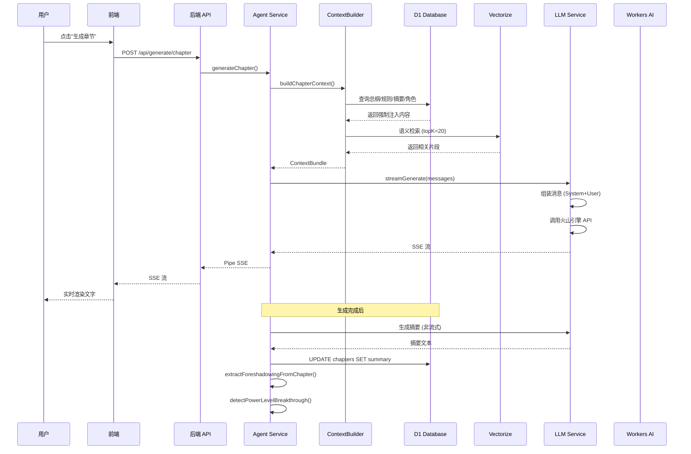

# NovelForge · 系统架构设计

> 本文档详细描述了 NovelForge 的系统架构、技术选型、数据流设计和核心模块实现原理。

---

## 📋 目录

- [总体架构](#总体架构)
- [技术栈详解](#技术栈详解)
- [数据模型设计](#数据模型设计)
- [核心服务模块](#核心服务模块)
- [AI 工作流](#ai-工作流)
- [性能优化策略](#性能优化策略)
- [安全考虑](#安全考虑)

---

## 总体架构

### 架构图

```
┌─────────────────────────────────────────────────────────────────────┐
│                         Client Browser                               │
└─────────────────────────────────────────────────────────────────────┘
                                    │
                                    ▼
┌─────────────────────────────────────────────────────────────────────┐
│                      Cloudflare Pages CDN                            │
│  ┌───────────────────────────────────────────────────────────────┐  │
│  │  Static Assets (dist/)                                         │  │
│  │  - index.html                                                  │  │
│  │  - assets/index-*.js                                           │  │
│  │  - assets/index-*.css                                          │  │
│  └───────────────────────────────────────────────────────────────┘  │
│  ┌───────────────────────────────────────────────────────────────┐  │
│  │  Functions /api/[[route]]                                      │  │
│  │  ┌─────────────────────────────────────────────────────────┐  │  │
│  │  │         Hono Application (server/index.ts)               │  │  │
│  │  │  ┌─────────┐ ┌─────────┐ ┌─────────┐ ┌─────────┐       │  │  │
│  │  │  │ novels  │ │volumes  │ │chapters │ │characters│      │  │  │
│  │  │  └─────────┘ └─────────┘ └─────────┘ └─────────┘       │  │  │
│  │  │  ┌─────────┐ ┌──────────┐ ┌─────────┐ ┌──────────┐    │  │  │
│  │  │  │generate │ │  export  │ │settings │ │  health  │    │  │  │
│  │  │  └─────────┘ └──────────┘ └─────────┘ └──────────┘    │  │  │
│  │  │  ┌─────────────┐ ┌─────────────┐ ┌─────────────┐      │  │  │
│  │  │  │foreshadowing│ │writing-rules│ │master-outline│     │  │  │
│  │  │  └─────────────┘ └─────────────┘ └─────────────┘      │  │  │
│  │  │  ┌─────────────┐ ┌─────────────┐ ┌─────────────┐      │  │  │
│  │  │  │novel-settings│ │   search   │ │  vectorize  │      │  │  │
│  │  │  └─────────────┘ └─────────────┘ └─────────────┘      │  │  │
│  │  │  ┌─────────────┐                                        │  │  │
│  │  │  │     mcp     │  (MCP Server for Claude Desktop)      │  │  │
│  │  │  └─────────────┘                                        │  │  │
│  │  │  ┌──────────┐ ┌───────────┐ ┌──────────────┐           │  │  │
│  │  │  │   auth   │ │  setup    │ │system-settings│ (v1.5)  │  │  │
│  │  │  └──────────┘ └───────────┘ └──────────────┘           │  │  │
│  │  │  ┌──────────────┐ ┌────────────────┐                   │  │  │
│  │  │  │ invite-codes │ │   workshop     │ (v1.5)            │  │  │
│  │  │  └──────────────┘ └────────────────┘                   │  │  │
│  │  └─────────────────────────────────────────────────────────┘  │  │
│  └───────────────────────────────────────────────────────────────┘  │
└─────────────────────────────────────────────────────────────────────┘
                    │                     │                    │
        ┌───────────┘                     │                    └──────┐
        │                                 │                           │
┌───────▼──────────┐            ┌────────▼────────┐        ┌─────────▼──────┐
│   D1 Database    │            │  Vectorize      │        │   R2 Bucket    │
│  (SQLite Edge)   │            │ (Vector Search) │        │  (Object Store)│
├──────────────────┤            ├─────────────────┤        ├────────────────┤
│ - novels         │            │ - embeddings    │        │ - character    │
│ - users          │ (v1.5)     │   (768 dim)     │        │   images       │
│ - invite_codes   │ (v1.5)     │ - metadata      │        │ - exports      │
│ - system_settings│ (v1.5)     │   indexing      │        │ - covers       │
│ - master_outline │            └─────────────────┘        └────────────────┘
│ - writing_rules  │
│ - novel_settings │
│ - volumes        │
│ - chapters       │
│ - characters     │
│ - foreshadowing  │
│ - workshop_sessions│ (v1.5)
│ - model_configs  │
│ - generation_logs│
│ - exports        │
│ - vector_index   │
│ - entity_index   │
└──────────────────┘
        │
        ▼
┌──────────────────┐
│  Workers AI      │
│  (Edge Inference)│
├──────────────────┤
│ - BGE Base zh    │ (Embedding)
│ - LLaVA 1.5 7B   │ (Vision)
│ - Doubao/Claude  │ (LLM via API)
└──────────────────┘
```

### 架构特点

1. **边缘优先 (Edge-First)**
   - 所有计算都在 Cloudflare 边缘网络运行
   - 全球 300+ 数据中心自动路由，延迟最低化
   - 无服务器冷启动问题

2. **单包架构 (Monorepo-free)**
   - 前端和后端在同一仓库
   - `functions/` 目录作为唯一后端入口
   - `server/` 目录存放业务逻辑，被 functions 引用

3. **类型安全 (Type-Safe)**
   - TypeScript 端到端类型覆盖
   - Drizzle ORM 提供数据库类型安全
   - Zod 运行时验证

4. **扁平化数据模型 (v2.0)**
   - 避免深层嵌套的树形结构
   - 总纲表替代多层大纲树
   - 设定表统一管理世界观/境界/势力/地理/宝物功法
   - 总索引表串联所有实体形成树形结构

---

## 技术栈详解

### 前端技术栈

| 技术 | 版本 | 用途 | 选择理由 |
|------|------|------|----------|
| **React** | 19.2 | UI 框架 | 成熟的组件生态，Hooks 模式 |
| **TypeScript** | 6.0 | 类型系统 | 端到端类型安全 |
| **Vite** | 8.0 | 构建工具 | 极速 HMR，生产优化 |
| **React Router** | 7.14 | 路由 | 声明式路由，嵌套布局 |
| **Zustand** | 5.0 | 状态管理 | 轻量级，无需 Provider 嵌套 |
| **TanStack Query** | 5.99 | 服务端状态 | 缓存、重试、乐观更新 |
| **shadcn/ui** | - | UI 组件 | 可定制，基于 Radix |
| **Tailwind CSS** | 3.4 | 样式 | 原子化 CSS，开发效率 |
| **Novel.js** | 1.0 | 编辑器 | Tiptap 封装，AI 友好 |
| **Lucide React** | 1.8 | 图标 | 统一图标库，Tree-shaking |

### 后端技术栈

| 技术 | 版本 | 用途 | 选择理由 |
|------|------|------|----------|
| **Hono** | 4.12 | Web 框架 | 超轻量，Cloudflare 原生 |
| **Drizzle ORM** | 0.45 | ORM | SQL-like 语法，Type-safe |
| **Zod** | 4.3 | 验证 | 运行时类型安全 |
| **@hono/zod-validator** | 0.7 | 验证中间件 | Hono + Zod 集成 |

### 基础设施

| 服务 | 用途 | 配额 | 成本 |
|------|------|------|------|
| **Cloudflare Pages** | 静态托管 + Functions | 100GB/月带宽 | 免费 |
| **D1** | 关系数据库 | 100 万读/日，10 万写/日 | 免费 |
| **R2** | 对象存储 | 10GB 存储，100 万 A 类操作 | 免费 |
| **Vectorize** | 向量搜索 | 1000 索引/账户 | 免费 |
| **Workers AI** | AI 推理 | 10 万 秒/日 | 免费 |

---

## 数据模型设计

### ER 图

```
┌─────────────┐       ┌──────────────┐       ┌─────────────┐
│   novels    │1─────n│   volumes    │1─────n│   chapters  │
├─────────────┤       ├──────────────┤       ├─────────────┤
│ id          │       │ id           │       │ id          │
│ title       │       │ novelId      │◄──────┤ novelId     │
│ description │       │ title        │       │ volumeId    │
│ genre       │       │ outline      │       │ title       │
│ status      │       │ blueprint    │       │ content     │
│ coverR2Key  │       │ summary      │       │ wordCount   │
│ wordCount   │       │ wordCount    │       │ status      │
│ chapterCount│       │ status       │       │ summary     │
│ created_at  │       │ created_at   │       │ vectorId    │
│ updated_at  │       │ updated_at   │       │ created_at  │
│ deletedAt   │       └──────────────┘       │ updated_at  │
└─────────────┘                              │ deletedAt   │
     │                                       └─────────────┘
     │                                                    │
     │ n                                                  │ n
     │                        ┌──────────────┐            │
     └───────────────────────►│  characters  │            │
                              ├──────────────┤            │
                              │ id           │            │
                              │ novelId      │◄───────────┘
                              │ name         │
                              │ aliases      │
                              │ role         │
                              │ description  │
                              │ imageR2Key   │
                              │ powerLevel   │◄── 境界信息 (JSON)
                              │ vectorId     │
                              │ created_at   │
                              │ deletedAt    │
                              └──────────────┘

┌─────────────────┐       ┌────────────────┐       ┌─────────────────┐
│ master_outline  │       │ writing_rules  │       │ novel_settings  │
├─────────────────┤       ├────────────────┤       ├─────────────────┤
│ id              │       │ id             │       │ id              │
│ novelId         │       │ novelId        │       │ novelId         │
│ title           │       │ category       │       │ type            │
│ content         │       │ title          │       │ category        │
│ version         │       │ content        │       │ name            │
│ summary         │       │ priority       │       │ content         │
│ wordCount       │       │ isActive       │       │ attributes      │
│ vectorId        │       │ sortOrder      │       │ parentId        │
│ created_at      │       │ created_at     │       │ importance      │
│ deletedAt       │       │ deletedAt      │       │ vectorId        │
└─────────────────┘       └────────────────┘       └─────────────────┘

┌─────────────────┐       ┌─────────────────┐       ┌─────────────────┐
│ foreshadowing   │       │ generation_logs │       │   vector_index  │
├─────────────────┤       ├─────────────────┤       ├─────────────────┤
│ id              │       │ id              │       │ id              │
│ novelId         │       │ novelId         │       │ novelId         │
│ chapterId       │       │ chapterId       │       │ sourceType      │
│ title           │       │ stage           │       │ sourceId        │
│ description     │       │ modelId         │       │ chunkIndex      │
│ status          │       │ promptTokens    │       │ contentHash     │
│ resolvedChapterId│      │ completionTokens│       │ created_at      │
│ importance      │       │ durationMs      │       └─────────────────┘
│ created_at      │       │ status          │
│ deletedAt       │       │ created_at      │
└─────────────────┘       └─────────────────┘

┌─────────────────┐       ┌─────────────────┐
│  entity_index   │       │  model_configs  │
├─────────────────┤       ├─────────────────┤
│ id              │       │ id              │
│ entityType      │       │ novelId         │
│ entityId        │       │ scope           │
│ novelId         │       │ stage           │
│ parentId        │       │ provider        │
│ title           │       │ modelId         │
│ sortOrder       │       │ apiBase         │
│ depth           │       │ apiKeyEnv       │
│ meta            │       │ params          │
│ created_at      │       │ isActive        │
│ updated_at      │       │ created_at      │
└─────────────────┘       └─────────────────┘
```

### 核心表说明

#### `novels` - 小说主表
```sql
CREATE TABLE novels (
  id TEXT PRIMARY KEY,           -- UUID (前 16 字符)
  title TEXT NOT NULL,           -- 标题
  description TEXT,              -- 简介
  genre TEXT,                    -- 类型：玄幻/仙侠/都市...
  status TEXT DEFAULT 'draft',   -- draft/writing/completed/archived
  cover_r2_key TEXT,             -- 封面图片 R2 路径
  word_count INTEGER DEFAULT 0,  -- 总字数
  chapter_count INTEGER DEFAULT 0,-- 章节数
  created_at INTEGER,            -- Unix 时间戳
  updated_at INTEGER,
  deletedAt INTEGER              -- 软删除标记
);
```

#### `master_outline` - 总纲表（v2.0 新增）
```sql
CREATE TABLE master_outline (
  id TEXT PRIMARY KEY,
  novel_id TEXT NOT NULL,
  title TEXT NOT NULL,
  content TEXT,                  -- 总纲内容 (Markdown)
  version INTEGER DEFAULT 1,     -- 版本号
  summary TEXT,                  -- 摘要
  word_count INTEGER DEFAULT 0,
  vector_id TEXT,                -- Vectorize 索引 ID
  indexed_at INTEGER,
  created_at INTEGER,
  updated_at INTEGER,
  deletedAt INTEGER
);
```

#### `writing_rules` - 创作规则表（v2.0 新增）
```sql
CREATE TABLE writing_rules (
  id TEXT PRIMARY KEY,
  novel_id TEXT NOT NULL,
  category TEXT NOT NULL,        -- style/pacing/character/plot/world/taboo/custom
  title TEXT NOT NULL,
  content TEXT NOT NULL,
  priority INTEGER DEFAULT 3,    -- 1=最高 5=最低
  is_active INTEGER DEFAULT 1,
  sort_order INTEGER DEFAULT 0,
  created_at INTEGER,
  updated_at INTEGER,
  deletedAt INTEGER
);
```

#### `novel_settings` - 小说设定表（v2.0/v4.0 增强）
```sql
CREATE TABLE novel_settings (
  id TEXT PRIMARY KEY,
  novel_id TEXT NOT NULL,
  type TEXT NOT NULL,            -- worldview/power_system/faction/geography/item_skill/misc
  category TEXT,                 -- 子分类
  name TEXT NOT NULL,
  content TEXT NOT NULL,
  summary TEXT,                  -- v4.0 新增：设定摘要，用于 RAG 索引
  attributes TEXT,               -- JSON
  parent_id TEXT,                -- 层级结构
  importance TEXT DEFAULT 'normal',
  related_ids TEXT,              -- JSON 关联 ID 列表
  vector_id TEXT,
  indexed_at INTEGER,
  sort_order INTEGER DEFAULT 0,
  created_at INTEGER,
  updated_at INTEGER,
  deletedAt INTEGER
);
```

#### `volumes` - 卷表（增强版）
```sql
CREATE TABLE volumes (
  id TEXT PRIMARY KEY,
  novel_id TEXT NOT NULL,
  title TEXT NOT NULL,
  sort_order INTEGER DEFAULT 0,
  outline TEXT,                  -- 卷大纲 (Markdown)
  blueprint TEXT,                -- 卷蓝图 (JSON)
  summary TEXT,                  -- 卷概要/摘要
  status TEXT DEFAULT 'draft',
  word_count INTEGER DEFAULT 0,
  chapter_count INTEGER DEFAULT 0,
  target_word_count INTEGER,
  notes TEXT,                    -- 作者笔记
  created_at INTEGER,
  updated_at INTEGER,
  deletedAt INTEGER
);
```

#### `chapters` - 章节
```sql
CREATE TABLE chapters (
  id TEXT PRIMARY KEY,
  novel_id TEXT NOT NULL,
  volume_id TEXT,
  title TEXT NOT NULL,
  sort_order INTEGER DEFAULT 0,
  content TEXT,                  -- 正文内容 (HTML)
  word_count INTEGER DEFAULT 0,
  status TEXT DEFAULT 'draft',   -- draft/generated/revised
  model_used TEXT,
  prompt_tokens INTEGER,
  completion_tokens INTEGER,
  generation_time INTEGER,
  summary TEXT,
  summary_model TEXT,
  summary_at INTEGER,
  vector_id TEXT,
  indexed_at INTEGER,
  snapshot_keys TEXT,            -- 快照存储路径
  created_at INTEGER,
  updated_at INTEGER,
  deletedAt INTEGER
);
```

#### `characters` - 角色
```sql
CREATE TABLE characters (
  id TEXT PRIMARY KEY,
  novel_id TEXT NOT NULL,
  name TEXT NOT NULL,
  aliases TEXT,                  -- JSON string[]
  role TEXT,                     -- protagonist/antagonist/supporting
  description TEXT,
  image_r2_key TEXT,
  attributes TEXT,               -- JSON 属性对象
  power_level TEXT,              -- JSON 境界信息 (v2.0 新增)
  vector_id TEXT,
  created_at INTEGER,
  deletedAt INTEGER
);
```

#### `foreshadowing` - 伏笔追踪表（v2.0 新增）
```sql
CREATE TABLE foreshadowing (
  id TEXT PRIMARY KEY,
  novel_id TEXT NOT NULL,
  chapter_id TEXT,               -- 埋下伏笔的章节
  title TEXT NOT NULL,
  description TEXT,
  status TEXT DEFAULT 'open',    -- open/resolved/abandoned
  resolved_chapter_id TEXT,      -- 收尾章节
  importance TEXT DEFAULT 'normal', -- high/normal/low
  created_at INTEGER,
  updated_at INTEGER,
  deletedAt INTEGER
);
```

#### `model_configs` - 模型配置
```sql
CREATE TABLE model_configs (
  id TEXT PRIMARY KEY,
  novel_id TEXT,                 -- NULL = 全局配置
  scope TEXT DEFAULT 'global',   -- global/novel
  stage TEXT NOT NULL,           -- outline_gen/chapter_gen/summary_gen/vision
  provider TEXT NOT NULL,        -- volcengine/anthropic/openai
  model_id TEXT NOT NULL,
  api_base TEXT,
  api_key_env TEXT,              -- 环境变量名（不存明文）
  api_key TEXT,                  -- 可选：直接存储（不推荐）
  params TEXT,                   -- JSON {temperature, max_tokens...}
  is_active INTEGER DEFAULT 1,
  created_at INTEGER,
  updated_at INTEGER
);
```

#### `generation_logs` - 生成任务日志（v2.0 新增）
```sql
CREATE TABLE generation_logs (
  id TEXT PRIMARY KEY,
  novel_id TEXT NOT NULL,
  chapter_id TEXT,
  stage TEXT NOT NULL,
  model_id TEXT NOT NULL,
  context_snapshot TEXT,         -- 上下文快照
  prompt_tokens INTEGER,
  completion_tokens INTEGER,
  duration_ms INTEGER,
  status TEXT DEFAULT 'success',
  error_msg TEXT,
  created_at INTEGER
);
```

#### `vector_index` - 向量索引追踪（v2.0 新增）
```sql
CREATE TABLE vector_index (
  id TEXT PRIMARY KEY,
  novel_id TEXT NOT NULL,
  source_type TEXT NOT NULL,     -- outline/chapter/character/summary
  source_id TEXT NOT NULL,
  chunk_index INTEGER DEFAULT 0,
  content_hash TEXT,
  created_at INTEGER
);
```

#### `entity_index` - 总索引表（v2.0 新增）
```sql
CREATE TABLE entity_index (
  id TEXT PRIMARY KEY,
  entity_type TEXT NOT NULL,     -- novel/volume/chapter/character/setting/rule/foreshadowing
  entity_id TEXT NOT NULL,
  novel_id TEXT NOT NULL,
  parent_id TEXT,
  title TEXT NOT NULL,
  sort_order INTEGER DEFAULT 0,
  depth INTEGER DEFAULT 0,
  meta TEXT,                     -- JSON 元数据
  created_at INTEGER,
  updated_at INTEGER,
  deletedAt INTEGER              -- v1.5.0 新增软删除支持
);
```

#### `users` - 用户表（v3.0/v1.5.0 新增）
```sql
CREATE TABLE users (
  id TEXT PRIMARY KEY,
  username TEXT NOT NULL UNIQUE,
  email TEXT NOT NULL UNIQUE,
  password_hash TEXT NOT NULL,    -- PBKDF2 哈希值
  salt TEXT NOT NULL,             -- 随机盐值
  role TEXT DEFAULT 'user',       -- admin/user
  is_deleted INTEGER DEFAULT 0,   -- 软删除标记
  created_at INTEGER,
  updated_at INTEGER,
  deletedAt INTEGER
);

-- 索引
CREATE INDEX idx_users_username ON users(username) WHERE deletedAt IS NULL;
CREATE INDEX idx_users_email ON users(email) WHERE deletedAt IS NULL;
```

#### `invite_codes` - 邀请码表（v3.0/v1.5.0 新增）
```sql
CREATE TABLE invite_codes (
  id TEXT PRIMARY KEY,
  code TEXT NOT NULL UNIQUE,
  max_uses INTEGER DEFAULT 1,    -- 最大使用次数
  used_count INTEGER DEFAULT 0,  -- 已使用次数
  status TEXT DEFAULT 'active',  -- active/used/expired/disabled
  expires_at INTEGER,            -- 过期时间（null=永不过期）
  created_by TEXT,               -- 创建者用户 ID
  created_at INTEGER,
  updated_at INTEGER
);

-- 索引
CREATE INDEX idx_invite_codes_code ON invite_codes(code) WHERE status = 'active';
```

#### `system_settings` - 系统设置表（v3.0/v1.5.0 新增）
```sql
CREATE TABLE system_settings (
  key TEXT PRIMARY KEY,
  value TEXT NOT NULL,
  description TEXT,
  updated_at INTEGER
);
```

#### `queue_task_logs` - 队列任务日志表（v4.0 新增）
```sql
CREATE TABLE queue_task_logs (
  id TEXT PRIMARY KEY,
  novel_id TEXT,
  task_type TEXT NOT NULL,       -- index_content/reindex_all/rebuild_entity_index/
                                 -- extract_foreshadowing/post_process_chapter
  status TEXT DEFAULT 'pending', -- pending/running/success/failed
  payload TEXT,                   -- JSON 任务载荷
  error_msg TEXT,
  retry_count INTEGER DEFAULT 0,
  created_at INTEGER,
  finished_at INTEGER
);

CREATE INDEX idx_queue_logs_novel ON queue_task_logs(novel_id, created_at DESC);
CREATE INDEX idx_queue_logs_status ON queue_task_logs(status, created_at DESC);
```

#### `workshop_sessions` - 创意工坊会话表（v1.5.0 增强）
```sql
CREATE TABLE workshop_sessions (
  id TEXT PRIMARY KEY,
  user_id TEXT NOT NULL,
  title TEXT NOT NULL,
  stage TEXT DEFAULT 'concept',  -- concept/worldbuilding/character/volume
  data TEXT,                     -- JSON 存储会话数据
  created_at INTEGER,
  updated_at INTEGER,
  deletedAt INTEGER              -- v1.5.0 新增软删除支持
);
```

---

## 核心服务模块

### 1. LLM 服务 (`/server/services/llm.ts`)

**职责**: 统一 LLM API 调用接口，支持多提供商切换

**核心功能**:
- 流式生成 (`streamGenerate`) - SSE 实时输出
- 非流式生成 (`generate`) - 用于摘要等场景
- 配置解析 (`resolveConfig`) - 优先级：小说级 > 全局 > Fallback

**支持的提供商**:
```typescript
{
  volcengine: {
    base: 'https://ark.cn-beijing.volces.com/api/v3',
    models: ['doubao-seed-2-pro', 'doubao-pro-32k']
  },
  anthropic: {
    base: 'https://api.anthropic.com/v1',
    models: ['claude-sonnet-4-20250514', 'claude-haiku-4-5-20251001']
  },
  openai: {
    base: 'https://api.openai.com/v1',
    models: ['gpt-4o', 'gpt-4o-mini']
  }
}
```

**代码示例**:
```typescript
// 流式生成
await streamGenerate(config, messages, {
  onChunk: (text) => console.log(text),
  onDone: (usage) => console.log(usage),
  onError: (err) => console.error(err)
})
```

---

### 2. Agent 系统 (`/server/services/agent/`)

**职责**: 基于 ReAct 模式的智能章节生成（v1.6.0 模块化重构）

**目录结构**:
```
agent/
├── index.ts         # 统一导出
├── types.ts         # 类型定义
├── constants.ts     # 常量定义
├── batch.ts         # 批量大纲生成
├── checkLogService.ts # 检查日志服务
├── coherence.ts     # 章节连贯性检查
├── consistency.ts   # 角色一致性检查
├── executor.ts      # 执行器
├── generation.ts    # 生成逻辑
├── logging.ts       # 日志记录
├── messages.ts      # 消息处理
├── reactLoop.ts     # ReAct 循环
├── summarizer.ts    # 摘要生成
└── tools.ts         # 工具定义
```

**ReAct 流程**:
```
1. 接收章节 ID → 构建上下文 (ContextBuilder v4)
2. 组装 System Prompt（角色设定 + 写作风格）
3. 调用 LLM 流式生成
4. 支持多轮工具调用（queryOutline/queryCharacter/searchSemantic）
5. 生成完成后自动触发摘要生成
```

**Agent 配置**:
```typescript
interface AgentConfig {
  maxIterations?: number    // 最大迭代次数 (默认 3)
  enableRAG?: boolean       // 启用 RAG (默认 true)
  enableAutoSummary?: boolean // 自动摘要 (默认 true)
}
```

---

### 3. 上下文组装器 (`/server/services/contextBuilder.ts`)

**职责**: 为 LLM 组装最优上下文组合（v4.0 重大优化）

**v4.0 核心改进**:
- **架构优化**: RAG 返回 ID → DB 查完整卡片（替代原来的 RAG 直接返回碎片）
- **Token 预算大幅增加**: Total 从 14k 提升至 55k tokens
- **RAG 查询优化**: 从 3 次减少到 2 次
- **向量类型精简**: 从 6 种减少到 3 种（character/setting/foreshadowing）
- **超时根治**: 单次索引任务最大 1 个 chunk

**Token 预算分配 (v4.0)**:
```
Total: 55,000 tokens
├─ Core Layer: ≤18,000
│  ├─ 总纲: ≤10,000
│  ├─ 卷规划: ≤1,500
│  ├─ 上一章: ≤500
│  ├─ 主角卡: ≤3,000
│  └─ 创作规则: ≤5,000
└─ Dynamic Layer: ≤37,000
   ├─ 摘要链: ≤10,000 (20章)
   ├─ 出场角色: ≤8,000
   ├─ 世界设定: ≤12,000
   ├─ 待回收伏笔: ≤4,000
   └─ 本章规则: ≤3,000
```

**强制注入内容 (v4.0)**:
- 总纲内容（来自 `master_outline.content`，使用全文）
- 创作规则（来自 `writing_rules`，全部 isActive=1，不限 priority）
- 本章大纲（来自 `novel_settings` 或卷大纲）
- 上一章摘要（来自 `chapters.summary`）
- 当前卷概要（来自 `volumes.summary`）
- 主角卡片（来自 `characters`，包含描述、属性和境界信息）

**RAG 检索 (v4.0)**:
- 仅检索 3 种类型: character, setting, foreshadowing
- 使用 summary 字段（≤400字）作为索引内容
- 高重要性设定追加 DB 全文

---

### 4. 嵌入服务 (`/server/services/embedding.ts`)

**模型**: `@cf/baai/bge-base-zh-v1.5`
- 维度：768
- 语言：中文优化
- 场景：语义相似度

**v4.0 优化**:
- 使用 `summary` 字段作为索引内容（≤400字），避免超长文本
- 单次索引任务最大 1 个 chunk，从根本上杜绝超时
- 仅索引 3 种类型：character、setting、foreshadowing

**功能**:
```typescript
// 文本向量化
const vector = await embedText(ai, text)

// 相似度搜索
const results = await searchSimilar(vectorize, queryVector, {
  topK: 20,
  filter: { novelId }
})
```

---

### 5. 视觉服务 (`/server/services/vision.ts`)

**模型**: `@cf/llava-hf/llava-1.5-7b-hf`

**功能**:
- 上传图片到 R2
- 分析角色图片，提取：
  - 外貌描述（发型、五官、服饰）
  - 气质特征（冷峻、温暖、神秘）
  - 性格推测
  - 标签（3-5 个关键词）

**Prompt 设计**:
```
请仔细观察这张角色图片，用中文详细描述：
1. 外貌特征：发型、发色、眼睛、面部轮廓、体型、穿着
2. 气质特点：整体感觉（冷峻/温暖/神秘...）
3. 性格推测：从外貌和表情推测
4. 标签：3-5 个关键词

请以 JSON 格式返回：
{
  "description": "...",
  "appearance": "...",
  "traits": [...],
  "tags": [...]
}
```

---

### 6. 导出服务 (`/server/services/export.ts`)

**支持的格式**:
| 格式 | 库 | 特点 |
|------|-----|------|
| Markdown | 自定义 | `.md` 文件，保留层级 |
| TXT | 自定义 | `.txt` 纯文本 |
| EPUB | `epub-gen-memory` | 电子书格式，含目录 |
| ZIP | `jszip` | 打包所有章节 |

**EPUB 元数据**:
```typescript
{
  title: novel.title,
  author: config.author || 'Unknown',
  language: 'zh-CN',
  creator: 'NovelForge',
  generator: 'NovelForge v1.4.0'
}
```

---

### 7. 伏笔追踪服务 (`/server/services/foreshadowing.ts`) (v2.0 新增)

**职责**: 自动从章节内容中提取伏笔，追踪伏笔状态

**核心功能**:
- `extractForeshadowingFromChapter()` - 从章节提取伏笔
- 自动检测已收尾的伏笔
- 支持重要性分级（high/normal/low）

**工作流程**:
```
1. 章节生成完成后触发
2. 获取章节内容和当前未收尾伏笔列表
3. 调用 LLM 分析章节内容
4. 识别新伏笔和已收尾伏笔
5. 写入数据库并更新状态
```

---

### 8. 境界追踪服务 (`/server/services/powerLevel.ts`) (v2.0 新增)

**职责**: 自动检测角色境界突破事件，记录成长历程

**核心功能**:
- `detectPowerLevelBreakthrough()` - 检测境界突破
- 自动更新角色 `powerLevel` 字段
- 记录突破历史

**PowerLevel 数据结构**:
```typescript
interface PowerLevelData {
  system: string           // 境界体系名称（如"修仙境界"）
  current: string          // 当前境界（如"金丹期初期"）
  breakthroughs: Array<{
    chapterId: string
    from: string           // 突破前境界
    to: string             // 突破后境界
    note?: string          // 突破说明
    timestamp?: number     // 突破时间戳
  }>
  nextMilestone?: string   // 下一阶段目标
}
```

---

### 9. 创意工坊服务 (`/server/services/workshop.ts`) (v1.5.0 新增)

**职责**: 多阶段对话式创作引擎，帮助作者从零开始构建小说框架

**核心功能**:
- `createSession()` - 创建新的创意会话
- `chat()` - SSE 流式 AI 对话
- `extractStructuredData()` - 从 AI 回复中提取结构化数据
- `submitSession()` - 提交确认，生成完整的小说框架

**分阶段 Prompt 体系**:
```typescript
const STAGE_PROMPTS = {
  concept: {
    system: '你是一位专业的小说策划师...',
    userPrompt: '请告诉我你的小说创意...',
    extractFields: ['title', 'genre', 'synopsis', 'targetLength', 'coreAppeals']
  },
  worldbuilding: {
    system: '你是一位世界观构建专家...',
    userPrompt: '让我们构建这个世界观...',
    extractFields: ['worldSettings']
  },
  character: {
    system: '你是一位角色设计大师...',
    userPrompt: '现在来设计角色...',
    extractFields: ['characters']
  },
  volume: {
    system: '你是一位资深编辑...',
    userPrompt: '最后规划卷纲...',
    extractFields: ['volumes', 'plotThreads']
  }
}
```

**SSE 流式输出格式**:
```typescript
// 文本消息
{ type: 'message', event: 'message', data: { type: 'text', content: '...' } }

// 结构化数据
{ type: 'extracted_data', event: 'extracted_data', data: { genre: '玄幻', ... } }

// 完成
{ type: 'done', event: 'done', data: {} }
```

**提交流程**:
```
1. 验证必填字段（title, genre, synopsis）
2. 创建小说记录 (novels)
3. 创建总纲 (master_outline)
4. 批量创建角色 (characters)
5. 批量创建卷 (volumes)
6. 返回所有创建的 ID
```

---

### 10. 认证与安全模块 (`/server/lib/auth.ts`) (v1.5.0 新增)

**职责**: 用户认证、密码安全、JWT 管理

**核心功能**:

#### 密码哈希
```typescript
// PBKDF2 + SHA-256, 100,000 次迭代
async function hashPassword(password: string): Promise<{ hash: string; salt: string }> {
  const salt = crypto.getRandomValues(new Uint8Array(16));
  const encoder = new TextEncoder();
  const keyMaterial = await crypto.subtle.importKey(
    'raw',
    encoder.encode(password),
    'PBKDF2',
    false,
    ['deriveBits']
  );
  const hash = await crypto.subtle.deriveBits(
    { name: 'PBKDF2', salt, iterations: 100_000, hash: 'SHA-256' },
    keyMaterial,
    256
  );
  return { hash: arrayBufferToBase64(hash), salt: bufferToBase64(salt) };
}
```

#### JWT Token 管理
```typescript
// HS256 签名, 7 天有效期
interface JWTPayload {
  userId: string;
  username: string;
  role: 'admin' | 'user';
  iat: number;  // 签发时间
  exp: number;  // 过期时间 (iat + 7天)
}

// 密钥从环境变量获取
const JWT_SECRET = env.JWT_SECRET || 'novelforge-jwt-secret-key';
```

#### 认证中间件
```typescript
// JWT 认证中间件
async function authMiddleware(c: Context, next: Next) {
  const token = c.req.header('Authorization')?.replace('Bearer ', '');
  if (!token) return c.json({ error: '未提供认证令牌' }, 401);

  const payload = verifyToken(token);
  if (!payload) return c.json({ error: '认证令牌无效或已过期' }, 401);

  c.set('user', payload);
  await next();
}

// Admin 权限中间件
async function adminMiddleware(c: Context, next: Next) {
  const user = c.get('user');
  if (user.role !== 'admin') {
    return c.json({ error: '需要管理员权限' }, 403);
  }
  await next();
}
```

---

## AI 工作流

### 章节生成完整流程



### 自动向量化流程

```
触发时机:
- 总纲内容更新 (onMasterOutlineSave)
- 章节摘要生成 (onSummaryComplete)
- 角色描述更新 (onCharacterUpdate)
- 小说设定更新 (onNovelSettingsUpdate)

流程:
1. 检测内容变化
2. 调用 embedText() 生成向量
3. VECTORIZE.upsert({
     id: content.id,
     values: vector,
     metadata: {
       sourceType: 'master_outline'|'chapter'|'character'|'setting',
       novelId,
       title,
       content
     }
   })
4. 更新数据库 vectorId 字段
5. 更新 vector_index 追踪表
```

---

## 性能优化策略

### 1. 边缘缓存

```typescript
// 健康检查接口缓存
app.get('/health', (c) => {
  c.header('Cache-Control', 'no-cache')
  return c.json({ ok: true, ts: Date.now() })
})
```

### 2. Token 预算控制

```typescript
// 防止超长输入
const MAX_RAG_TOKENS = 4000
let usedTokens = 0
for (const chunk of ragResults) {
  const tokens = estimateTokens(chunk.content)
  if (usedTokens + tokens > MAX_RAG_TOKENS) break
  usedTokens += tokens
  selectedChunks.push(chunk)
}
```

### 3. 并发请求

```typescript
// 并行拉取强制注入内容
const [outline, prevSummary, volumeSummary, protagonists] =
  await Promise.all([
    fetchChapterOutline(db, chapterId),
    fetchPrevChapterSummary(db, chapterId),
    fetchVolumeSummary(db, chapterId),
    fetchProtagonistCards(db, chapterId)
  ])
```

### 4. 懒加载

```typescript
// TanStack Query 配置
const queryClient = new QueryClient({
  defaultOptions: {
    queries: {
      staleTime: 30 * 1000,  // 30 秒内不重新获取
      refetchOnWindowFocus: false
    }
  }
})
```

---

## 安全考虑

### 1. API Key 管理

**❌ 错误做法**:
```typescript
// 不要把 API Key 存入数据库！
const config = { apiKey: 'sk-xxx' }
db.insert(config)
```

**✅ 正确做法**:
```typescript
// 只存环境变量名，运行时读取
const config = { apiKeyEnv: 'VOLCENGINE_API_KEY' }
const apiKey = c.env[config.apiKeyEnv]  // 从 Secret 读取
```

### 2. 输入验证

```typescript
import { zValidator } from '@hono/zod-validator'

router.post('/', zValidator('json', CreateSchema), async (c) => {
  // Zod 自动验证，无效请求直接返回 400
  const data = c.req.valid('json')
})
```

### 3. 软删除

```typescript
// 永远不要物理删除！
await db.update(novels)
  .set({ deletedAt: sql`(unixepoch())` })
  .where(eq(novels.id, id))
```

### 4. CORS 配置

```typescript
// Hono 中间件
app.use('*', async (c, next) => {
  c.header('Access-Control-Allow-Origin', '*')
  c.header('Access-Control-Allow-Headers', 'Content-Type')
  c.header('Access-Control-Allow-Methods', 'GET,POST,PATCH,DELETE')
  await next()
})
```

---

## 监控与日志

### 健康检查

```bash
curl https://your-domain.pages.dev/api/health
# {"ok":true,"ts":1234567890,"phase":3}
```

### 错误日志

```typescript
try {
  await someOperation()
} catch (error) {
  console.error('Operation failed:', error)  // 写入 Workers 日志
  throw error
}
```

### Token 使用统计

```typescript
// 记录每次生成的 token 消耗
await db.update(chapters).set({
  promptTokens: usage.prompt_tokens,
  completionTokens: usage.completion_tokens
})
```

---

## 扩展性设计

### 1. 插件化 Provider

```typescript
// 新增 Provider 只需：
// 1. 在 llm.ts 添加 provider 配置
// 2. 实现对应的 API 适配层
// 3. 在前端 providers.ts 添加选项
```

### 2. 模块化 Services

```
services/
├── llm.ts           # LLM 调用（可替换）
├── embedding.ts     # 向量化（可换模型）
├── vision.ts        # 视觉分析（可换模型）
├── agent.ts         # Agent 逻辑（可改策略）
├── contextBuilder.ts # 上下文组装（可调参数）
└── export.ts        # 导出（可加格式）
```

### 3. 配置驱动

```typescript
// 所有行为都可通过 model_configs 调整
// 无需修改代码即可：
// - 切换模型
// - 调整 temperature
// - 设置 max_tokens
```

---

## 总结

NovelForge 采用现代化的边缘计算架构，充分利用 Cloudflare 生态的能力：

- **零运维**: 完全 Serverless，自动扩缩容
- **低延迟**: 全球边缘节点，用户就近访问
- **低成本**: 免费额度充足个人使用
- **高可用**: Cloudflare 99.99% SLA
- **易扩展**: 模块化设计，功能易于扩展

未来可扩展方向：
- Phase 4: 多用户 SaaS 化
- MCP 集成：接入 Claude Desktop
- PDF 导出：Cloudflare Browser Rendering
- 语音朗读：Workers AI TTS
