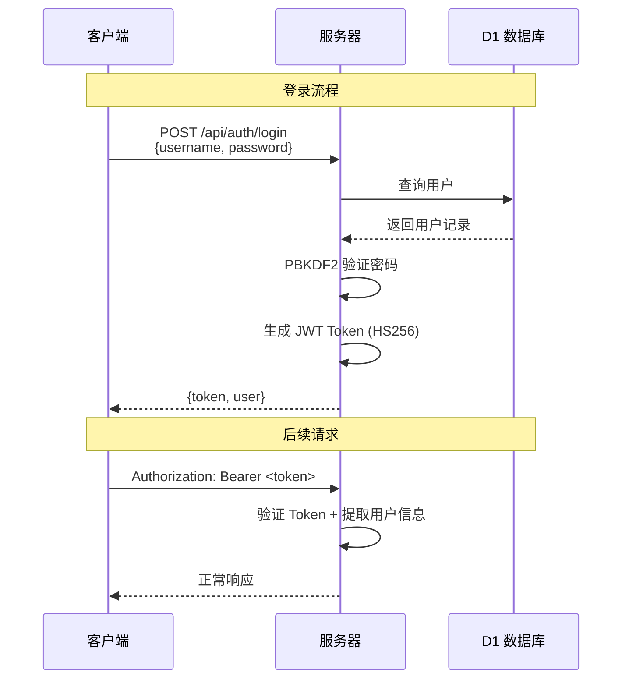
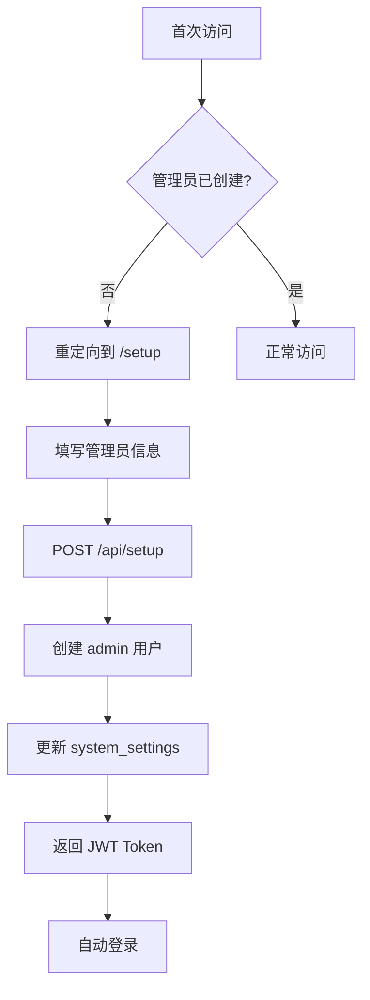
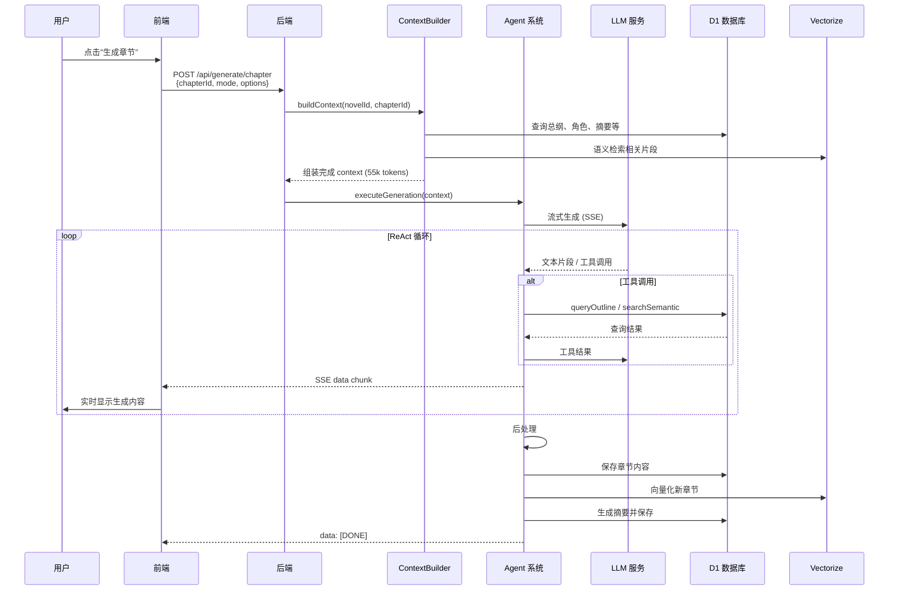
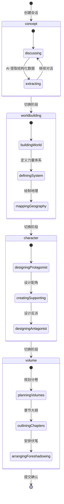
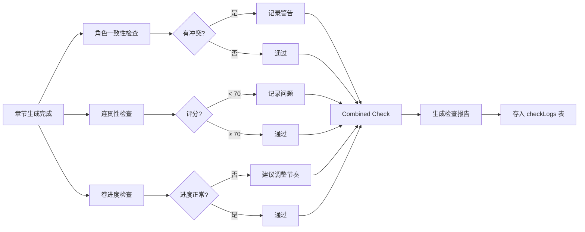

# NovelForge · 系统架构设计

> 完整的技术架构、数据流设计和模块依赖关系图。
>
> **版本**: 2.3.0 | **最后更新**: 2026-04-30

---

## 📋 目录

1. [系统概述](#系统概述)
2. [技术栈选型](#技术栈选型)
3. [整体架构](#整体架构)
4. [前端架构](#前端架构)
5. [后端架构](#后端架构)
6. [数据模型设计](#数据模型设计)
7. [核心业务流程](#核心业务流程)
8. [AI 生成架构](#ai-生成架构)
9. [RAG 检索增强生成](#rag-检索增强生成)
10. [Agent 系统 (v1.6.0)](#agent-系统-v160)
11. [向量检索系统](#向量检索系统)
12. [安全设计](#安全设计)
13. [性能优化策略](#性能优化策略)
14. [部署架构](#部署架构)

---

## 系统概述

NovelForge 是一个**AI 驱动的智能小说创作平台**，采用 **Cloudflare 边缘计算** 作为基础设施，实现了从创意构思到成稿发布的全流程数字化创作环境。

### 核心特性

| 特性 | 说明 |
|------|------|
| **边缘优先** | 全球 CDN 加速，延迟 <50ms |
| **Serverless 后端** | Cloudflare Pages Functions，按量付费 |
| **RAG 增强** | 语义检索 + ReAct Agent，上下文质量高 |
| **多模态 AI** | 文本生成 + 视觉分析 + 摘要提取 |
| **用户体系** | JWT 认证 + 邀请码 + 权限管理 |

### 设计原则

1. **边缘优先** - 前端静态资源全球分发，API 函数就近执行
2. **无状态设计** - JWT 认证，无需 Session 存储
3. **渐进式加载** - 路由懒加载 + 组件代码分割
4. **防御式编程** - Zod 运行时验证 + Drizzle ORM 类型安全
5. **可观测性** - 结构化日志 + 生成日志 + 检查日志

---

## 技术栈选型

### 为什么选择这个技术栈？

#### 前端：React + TypeScript + Vite

```
✅ React 19 - 最新并发特性，更好的性能
✅ TypeScript 6.0 - 全类型安全，减少运行时错误
✅ Vite 8 - 极速 HMR，生产构建优化
✅ shadcn/ui - 可定制组件库，不锁定样式
✅ Zustand 5 - 轻量状态管理，适合中小型应用
✅ TanStack Query 5.99 - 服务端状态管理 + 缓存
```

#### 后端：Hono + Cloudflare Workers

```
✅ Hono v4.12 - 轻量高性能 Web 框架，TypeScript 优先
✅ Cloudflare Pages Functions - Serverless API，自动扩缩容
✅ D1 数据库 - SQLite 兼容，边缘复制读取
✅ Vectorize - 原生向量数据库，支持 1024 维向量
✅ Queues - 异步任务处理，解耦耗时操作
✅ R2 对象存储 - S3 兼容，低成本图片存储
```

#### AI 集成：统一 LLM 抽象层

```
✅ 多提供商支持 - 20+ AI 提供商统一接口
✅ 流式输出 - SSE 实时推送生成内容
✅ 工具调用 - ReAct 模式，支持 Function Calling
✅ 向量嵌入 - BGE M3 多语言模型（1024 维）
✅ 视觉理解 - LLaVA 图片分析
```

---

## 整体架构

### 架构总览

```
┌─────────────────────────────────────────────────────────────┐
│                    用户浏览器 (Client)                        │
│  ┌──────────┐  ┌──────────┐  ┌───────────────────────────┐  │
│  │ React UI │  │ Zustand  │  │ TanStack Query (缓存层)   │  │
│  └────┬─────┘  └────┬─────┘  └─────────────┬─────────────┘  │
│       │              │                      │                │
│       └──────────────┼──────────────────────┘                │
│                      ▼                                       │
│              ┌──────────┐                                   │
│              │ API 封装  │ (src/lib/api.ts)                 │
│              └─────┬────┘                                   │
└────────────────────┼────────────────────────────────────────┘
                     │ HTTPS / SSE
                     ▼
┌─────────────────────────────────────────────────────────────┐
│              Cloudflare Pages (Edge)                         │
│  ┌─────────────────────────────────────────────────────┐    │
│  │            Hono Application (server/index.ts)        │    │
│  │                                                      │    │
│  │  ┌──────────┐  ┌──────────┐  ┌──────────────────┐   │    │
│  │  │ 认证中间件│  │ 路由层    │  │ 错误处理          │   │    │
│  │  └──────────┘  └────┬─────┘  └──────────────────┘   │    │
│  │                     │                                │    │
│  │  ┌──────────────────┼──────────────────────────┐    │    │
│  │  │              服务层 (Services)               │    │    │
│  │  │                                            │    │    │
│  │  │  ┌──────────┐ ┌──────────┐ ┌────────────┐  │    │    │
│  │  │  │ LLM 服务 │ │Agent 系统│ │ContextBuilder│  │    │    │
│  │  │  └──────────┘ └────┬─────┘ └────────────┘  │    │    │
│  │  │  ┌──────────┐ ┌────┴─────┐ ┌────────────┐  │    │    │
│  │  │  │Embedding │ │Export    │ │Workshop     │  │    │    │
│  │  │  └──────────┘ │Service   │ │Service      │  │    │    │
│  │  │  ┌──────────┐ └──────────┘ └────────────┘  │    │    │
│  │  │  │Vision    │                                    │    │
│  │  │  └──────────┘                                    │    │
│  │  └─────────────────────────────────────────────┘    │    │
│  └─────────────────────────────────────────────────────┘    │
└─────────────────────────────────────────────────────────────┘
         │           │              │             │
         ▼           ▼              ▼             ▼
   ┌──────────┐ ┌──────────┐ ┌──────────┐  ┌──────────────┐
   │ D1 DB    │ │Vectorize │ │ R2 存储  │  │  Queue 队列   │
   │(SQLite)  │ │(1024维)  │ │(图片/文件)│  │(异步任务)     │
   └──────────┘ └──────────┘ └──────────┘  └──────────────┘
         │                                              │
         ▼                                              ▼
   ┌────────────────────────────────────────────────────────┐
   │              External Services                          │
   │  ┌──────────────┐  ┌──────────────┐  ┌──────────────┐  │
   │  │ OpenAI API   │  │ Anthropic    │  │ Volcengine    │  │
   │  ├──────────────┤  ├──────────────┤  ├──────────────┤  │
   │  │ DeepSeek     │  │ Google Gemini│  │ 其他 15+      │  │
   │  └──────────────┘  └──────────────┘  └──────────────┘  │
   └────────────────────────────────────────────────────────┘
```

### 分层架构

```
┌─────────────────────────────────────────┐
│           表现层 (Presentation)          │
│  React Components + shadcn/ui           │
├─────────────────────────────────────────┤
│           应用层 (Application)           │
│  API Routes + Business Logic            │
├─────────────────────────────────────────┤
│           领域层 (Domain)                │
│  Services (LLM, Agent, ContextBuilder)  │
├─────────────────────────────────────────┤
│           基础设施层 (Infrastructure)     │
│  D1 + Vectorize + R2 + Queue            │
└─────────────────────────────────────────┘
```

---

## 前端架构

### 项目结构

```
src/
├── App.tsx                    # 应用根组件（路由+守卫）
├── main.tsx                   # 入口文件
├── pages/                     # 页面组件（路由级代码分割）
│   ├── LoginPage.tsx
│   ├── RegisterPage.tsx
│   ├── SetupPage.tsx
│   ├── NovelsPage.tsx
│   ├── WorkspacePage.tsx
│   ├── WorkshopPage.tsx
│   ├── ReaderPage.tsx
│   ├── ModelConfigPage.tsx
│   ├── AccountPage.tsx
│   └── AiMonitorPage.tsx     # AI监控中心 (v1.6.0)
├── components/
│   ├── ui/                    # shadcn 基础组件
│   ├── layout/                # 布局组件
│   │   ├── AppLayout.tsx      # 三栏布局
│   │   ├── MainLayout.tsx     # 主布局
│   │   ├── Sidebar.tsx        # 工作区侧边栏
│   │   └── WorkspaceHeader.tsx # 工作区顶栏
│   ├── novel/                 # 小说管理组件
│   ├── outline/               # 大纲编辑器
│   ├── chapter/               # 章节编辑器
│   ├── generate/              # AI 生成面板 (v1.6.0 增强)
│   │   ├── GeneratePanel.tsx
│   │   ├── StreamOutput.tsx
│   │   └── ContextPreview.tsx
│   ├── monitor/               # AI 监控中心 (v2.3.0 全面升级)
│   │   ├── QualityDashboard.tsx    # 质量监控仪表台
│   │   ├── QualityChart.tsx        # 质量趋势图表
│   │   ├── QualityDetailModal.tsx  # 质量详情弹窗
│   │   ├── ChapterQualityList.tsx  # 章节质量列表
│   │   ├── QualityScoreCard.tsx    # 质量评分卡片
│   │   ├── CostAnalysis.tsx        # 成本分析主组件
│   │   ├── CostBreakdownTable.tsx # 成本分类明细
│   │   ├── CostSummaryCards.tsx   # 成本汇总卡片
│   │   ├── CostTrendChart.tsx     # 成本趋势图表
│   │   └── types.ts               # 监控组件类型定义
│   ├── character/             # 角色管理
│   ├── workshop/              # 创意工坊 (v1.11.0 全新重构)
│   │   ├── WorkshopSidebar.tsx
│   │   ├── ChatInput.tsx              # 聊天输入 (v1.11.0)
│   │   ├── ChatMessageList.tsx         # 消息列表 (v1.11.0)
│   │   ├── CommitDialog.tsx            # 提交确认 (v1.11.0)
│   │   ├── PreviewPanel.tsx            # 预览面板 (v1.11.0)
│   │   ├── PreviewBasicInfo.tsx        # 基本信息预览 (v1.11.0)
│   │   ├── PreviewChapters.tsx         # 章节预览 (v1.11.0)
│   │   ├── PreviewCharacters.tsx        # 角色预览 (v1.11.0)
│   │   ├── PreviewVolumes.tsx          # 卷预览 (v1.11.0)
│   │   ├── PreviewWorldSettings.tsx    # 世界设定预览 (v1.11.0)
│   │   ├── PreviewWritingRules.tsx     # 规则预览 (v1.11.0)
│   │   ├── WelcomeView.tsx             # 欢迎视图 (v1.11.0)
│   │   ├── WorkshopHeaderActions.tsx   # 头部操作 (v1.11.0)
│   │   ├── ImportDataDialog.tsx        # 导入对话框 (v1.8.0)
│   │   └── types.ts                    # 类型定义 (v1.11.0)
│   ├── entitytree/            # 实体树面板 (v1.6.0)
│   ├── trash/                 # 回收站面板 (v1.6.0)
│   ├── chapter-health/        # 质量检查组件 (v1.6.0)
│   │   ├── ChapterCoherenceCheck.tsx
│   │   ├── ChapterHealthCheck.tsx
│   │   ├── CharacterConsistencyCheck.tsx
│   │   ├── CombinedCheck.tsx
│   │   └── VolumeProgressCheck.tsx
│   ├── foreshadowing/          # 伏笔追踪
│   ├── rules/                  # 创作规则
│   ├── model/                  # 模型配置
│   ├── novelsetting/           # 小说设定
│   ├── volume/                 # 卷管理
│   ├── powerlevel/             # 境界追踪
│   ├── export/                 # 导出功能
│   ├── search/                 # 内容搜索
│   ├── stats/                  # 写作统计
│   └── generation/             # 生成日志
├── store/                      # 状态管理
│   ├── authStore.ts            # 认证状态
│   ├── novelStore.ts           # 小说状态
│   └── readerStore.ts          # 阅读器状态
├── hooks/
│   └── useGenerate.ts          # 生成 Hook
├── lib/
│   ├── api.ts                  # API 封装
│   ├── providers.ts            # AI 提供商配置
│   ├── types.ts                # 类型定义
│   ├── formatContent.ts        # 格式化工具 (v1.6.0)
│   └── html-to-markdown.ts     # HTML转MD工具
└── utils/                      # 工具函数
```

### 路由设计

```typescript
// src/App.tsx - 路由配置
const routes = [
  { path: '/', element: <WorkspacePage /> },           // 工作区
  { path: '/novels', element: <NovelsPage /> },         // 小说列表
  { path: '/workshop', element: <WorkshopPage /> },     // 创意工坊
  { path: '/reader', element: <ReaderPage /> },         // 阅读器
  { path: '/setup', element: <SetupPage /> },           // 系统初始化
  { path: '/login', element: <LoginPage /> },           // 登录
  { path: '/register', element: <RegisterPage /> },     // 注册
  { path: '/account', element: <AccountPage /> },       // 账户设置
  { path: '/model-config', element: <ModelConfigPage /> }, // 模型配置
  { path: '/ai-monitor', element: <AiMonitorPage /> }   // AI监控中心
];
```

### 状态管理架构

```
┌─────────────────────────────────────────────┐
│              Zustand Store                   │
│                                             │
│  ┌─────────────┐  ┌──────────────────────┐  │
│  │ authStore   │  │ novelStore           │  │
│  │ - user      │  │ - currentNovel       │  │
│  │ - token     │  │ - chapters           │  │
│  │ - login()   │  │ - characters         │  │
│  │ - logout()  │  │ - volumes            │  │
│  └─────────────┘  │ - outline            │  │
│                   │ - foreshadowing      │  │
│  ┌─────────────┐  │ - settings           │  │
│  │ readerStore │  │ - rules              │  │
│  │ - theme     │  │ - powerLevels        │  │
│  │ - fontSize  │  └──────────────────────┘  │
│  │ - lineHeight│                             │
│  └─────────────┘                             │
└─────────────────────────────────────────────┘
         │
         ▼
┌─────────────────────────────────────────────┐
│          TanStack Query (缓存层)             │
│                                             │
│  - 自动缓存 API 响应                         │
│  - stale-while-revalidate 策略              │
│  - 乐观更新                                 │
│  - 并发请求去重                              │
└─────────────────────────────────────────────┘
```

### 核心页面组件关系

```
AppLayout
├── MainLayout
│   ├── Sidebar (导航菜单)
│   ├── WorkspaceHeader (面包屑+操作按钮)
│   └── 页面内容区
│       ├── WorkspacePage (工作区)
│       │   ├── OutlinePanel (大纲面板)
│       │   ├── ChapterList (章节列表)
│       │   ├── ChapterEditor (章节编辑器)
│       │   └── GeneratePanel (AI 生成面板)
│       │       ├── StreamOutput (SSE 流式输出)
│       │       └── ContextPreview (上下文预览)
│       ├── WorkshopPage (创意工坊)
│       │   ├── WorkshopSidebar (会话侧边栏)
│       │   └── ImportDataDialog (导入对话框)
│       └── AiMonitorPage (AI 监控中心)
│           ├── EntityTreePanel (实体树)
│           ├── TrashPanel (回收站)
│           └── GenerationLogs (生成日志)
└── 公共页面
    ├── LoginPage / RegisterPage
    ├── SetupPage (初始化向导)
    ├── AccountPage (账户设置)
    └── ModelConfigPage (模型配置)
```

---

## 后端架构

### 项目结构

```
server/
├── index.ts                    # Hono app 入口
├── queue-handler.ts            # 队列任务处理器 (v1.6.0)
├── routes/                     # 路由层
│   ├── auth.ts                 # 认证路由
│   ├── invite-codes.ts         # 邀请码路由
│   ├── setup.ts                # 初始化路由
│   ├── system-settings.ts      # 系统设置路由
│   ├── novels.ts               # 小说管理路由
│   ├── chapters.ts             # 章节管理路由
│   ├── characters.ts           # 角色管理路由
│   ├── volumes.ts              # 卷管理路由
│   ├── master-outline.ts       # 总纲管理路由
│   ├── writing-rules.ts        # 创作规则路由
│   ├── novel-settings.ts       # 小说设定路由
│   ├── foreshadowing.ts        # 伏笔管理路由
│   ├── generate.ts             # AI 生成路由
│   ├── search.ts               # 搜索路由
│   ├── export.ts               # 导出路由
│   ├── vectorize.ts            # 向量化索引路由
│   ├── entity-index.ts         # 实体索引路由
│   ├── power-level.ts          # 境界追踪路由
│   ├── mcp.ts                  # MCP 服务路由
│   ├── workshop.ts             # 创意工坊路由
│   ├── workshop-import.ts      # 工坊导入路由
│   ├── workshop-format-import.ts # 格式化导入路由
│   ├── batch.ts               # 批量生成路由 (v2.1.0)
│   ├── quality.ts             # 质量评分路由 (v2.1.0)
│   ├── cost-analysis.ts       # 成本分析路由 (v2.3.0)
│   └── settings.ts             # 模型配置路由
├── services/                   # 服务层
│   ├── llm.ts                  # LLM 统一调用层
│   ├── costAnalysis.ts          # 成本分析服务 (v2.3.0)
│   ├── agent/                  # Agent 系统 (v1.6.0 模块化重构)
│   │   ├── index.ts            # 统一导出
│   │   ├── types.ts            # 类型定义
│   │   ├── constants.ts        # 常量定义
│   │   ├── executor.ts         # 执行器
│   │   ├── generation.ts       # 生成逻辑
│   │   ├── reactLoop.ts        # ReAct 循环
│   │   ├── tools.ts            # 工具定义
│   │   ├── messages.ts         # 消息构建
│   │   ├── summarizer.ts       # 摘要生成
│   │   ├── logging.ts          # 日志记录
│   │   ├── checkLogService.ts  # 检查日志服务
│   │   ├── coherence.ts         # 连贯性检查
│   │   ├── consistency.ts      # 一致性检查
│   │   ├── volumeProgress.ts   # 卷进度检查
│   │   ├── batchGenerate.ts    # 批量生成服务 (v2.1.0)
│   │   ├── qualityCheck.ts     # 质量评分服务 (v2.1.0)
│   │   ├── prevChapterAdvice.ts # 上一章建议服务 (v2.1.0)
│   │   └── volumeCompletion.ts # 卷完成检测服务 (v2.1.0)
│   ├── contextBuilder.ts       # 上下文组装 (v4.0)
│   ├── embedding.ts            # 向量化服务
│   ├── vision.ts               # 视觉分析服务
│   ├── export.ts               # 导出服务
│   ├── foreshadowing.ts        # 伏笔追踪服务 (v1.7.0 增强)
│   ├── powerLevel.ts           # 境界追踪服务
│   ├── entity-index.ts         # 实体索引服务
│   ├── formatImport.ts         # 格式导入服务 (v1.7.0)
│   └── workshop/               # Workshop 服务模块化 (v1.11.0)
│       ├── index.ts            # 统一导出 (198行)
│       ├── commit.ts           # commit逻辑 (580行)
│       ├── extract.ts          # 数据提取 (100行)
│       ├── helpers.ts          # 辅助函数 (116行)
│       ├── prompt.ts           # 分阶段Prompt (660行)
│       ├── session.ts          # 会话管理 (264行)
│       └── types.ts            # 类型定义 (65行)
├── lib/
│   ├── auth.ts                 # 认证与安全模块
│   ├── queue.ts                # 队列操作库 (v2.3.0 新增quality_check/batch_chapter_done消息类型)
│   └── types.ts                # 共享类型定义
└── db/
    ├── schema.ts               # 数据库 Schema
└── migrations/             # 数据库迁移
    ├── 0000_schema.sql
    ├── 0001_add_post_processed_at.sql  # v2.3.0
```

### 中间件链

```typescript
// server/index.ts - 中间件配置
app.use('*', cors())
   .use('*', logger())
   .use('/api/*', authenticate())  // JWT 认证
   .use('/api/admin/*', requireAdmin())  // Admin 权限
   .onError(errorHandler);  // 全局错误处理
```

### 请求处理流程

```
客户端请求
    │
    ▼
┌─────────────┐
│ CORS 检查   │
└──────┬──────┘
       │
       ▼
┌─────────────┐
│ 日志记录     │
└──────┬──────┘
       │
       ▼
┌─────────────┐
│ JWT 认证    │ ← 除公开接口外
└──────┬──────┘
       │
       ▼
┌─────────────┐
│ 参数验证     │ ← Zod schema
└──────┬──────┘
       │
       ▼
┌─────────────┐
│ 业务逻辑     │ ← Service 层
└──────┬──────┘
       │
       ▼
┌─────────────┐
│ 数据持久化   │ ← Drizzle ORM
└──────┬──────┘
       │
       ▼
   返回响应
```

---

## 数据模型设计

### ER 关系图（核心实体）

```
┌──────────────┐       ┌──────────────┐       ┌──────────────┐
│    users     │       │    novels    │       │   volumes    │
├──────────────┤       ├──────────────┤       ├──────────────┤
│ id (PK)      │──┐    │ id (PK)      │──┐    │ id (PK)      │
│ username     │  │    │ userId (FK)  │  │    │ novelId (FK) │◄─┘
│ email        │  └───►│ title        │  └───►│ title        │
│ passwordHash │       │ genre        │       │ sortOrder    │
│ role         │       │ status       │       │ outline      │
│ status       │       │ wordCount    │       │ summary      │
│ inviteCodeId │       │ chapterCount │       │ wordCount    │
│ lastLoginAt  │       │ targetWordCount│      │ targetWordCount│
│ createdAt    │       │ targetChapterCount│    │ targetChapterCount│
│ updatedAt    │       │ deletedAt    │       │ status       │
└──────────────┘       │ coverR2Key   │       │ notes        │
                       │ createdAt    │       │ createdAt    │
                       │ updatedAt    │       │ updatedAt    │
                       └──────────────┘       └──────────────┘
                              │                      │
                              │                      │
       ┌──────────────────────┼──────────────────────┘
       │                      │
       ▼                      ▼
┌──────────────┐       ┌──────────────┐
│   chapters   │       │ characters   │
├──────────────┤       ├──────────────┤
│ id (PK)      │       │ id (PK)      │
│ novelId (FK) │       │ novelId (FK) │
│ volumeId (FK)│       │ name         │
│ title        │       │ aliases      │
│ content      │       │ role         │
│ wordCount    │       │ description  │
│ status       │       │ imageR2Key   │
│ modelUsed    │       │ attributes   │
│ summary      │       │ powerLevel   │
│ sortOrder    │       │ createdAt    │
│ createdAt    │       │ updatedAt    │
│ updatedAt    │       └──────────────┘
└──────────────┘
```

### 数据库表清单（共 19 张表）

| 表名 | 说明 | 主要字段 | 创建版本 |
|------|------|----------|----------|
| `users` | 用户表 | id, username, email, passwordHash, role, status, inviteCodeId, lastLoginAt | v1.0 |
| `inviteCodes` | 邀请码表 | id, code, maxUses, usedCount, status, expiresAt, createdBy | v1.5 |
| `systemSettings` | 系统设置 | key, value, description, updatedAt | v1.0 |
| `novels` | 小说表 | id, userId, title, description, genre, status, wordCount, chapterCount, **targetWordCount**, **targetChapterCount**, deletedAt | v1.0 (+v1.7.0) |
| `masterOutline` | 总纲表 | id, novelId, title, content, version, summary, wordCount | v1.0 |
| `writingRules` | 创作规则 | id, novelId, category, title, content, priority, isActive, sortOrder | v1.0 |
| `novelSettings` | 小说设定 | id, novelId, type, name, content, parentId, importance, attributes | v1.0 |
| `volumes` | 卷表 | id, novelId, title, sortOrder, outline, blueprint, summary, wordCount, chapterCount, **targetChapterCount**, status, notes | v1.0 (+v1.7.0) |
| `chapters` | 章节表 | id, novelId, volumeId, title, content, wordCount, status, modelUsed, summary, sortOrder, **postProcessedAt** | v1.0 (+v2.3.0) |
| `characters` | 角色表 | id, novelId, name, aliases, role, description, imageR2Key, attributes, powerLevel | v1.0 |
| `foreshadowing` | 伏笔表 | id, novelId, chapterId, title, description, status, importance | v1.0 |
| `foreshadowingProgress` | 伏笔进度 | id, foreshadowingId, chapterId, **progressType**, **summary**, **mentionedKeywords**, createdAt | v1.7.0 |
| `modelConfigs` | 模型配置 | id, novelId, scope, stage, provider, modelId, apiBase, apiKey, params, isActive | v1.0 |
| `generationLogs` | 生成日志 | id, novelId, chapterId, stage, modelId, promptTokens, completionTokens, durationMs, status | v1.0 |
| `exports` | 导出记录 | id, novelId, format, status, fileUrl, createdAt | v1.0 |
| `vectorIndex` | 向量索引 | id, novelId, sourceType, sourceId, vectorId, title, metadata, indexedAt | v1.0 |
| `entityIndex` | 实体索引 | id, novelId, entityType, entityId, name, metadata, childrenCount | v1.6.0 |
| `workshopSessions` | 工坊会话 | id, novelId, stage, status, extractedData, messages, title | v1.5 |
| `checkLogs` | 检查日志 | id, novelId, chapterId, checkType, score, result, **volumeProgressResult**, status | v1.6.0 (+v1.7.0) |
| `queueTaskLogs` | 队列任务日志 | id, taskType, novelId, payload, status, error, startedAt, completedAt | v1.6.0 |

> **注意**: 加粗字段为 v1.7.0 新增或修改的字段

### 数据库迁移历史

| 迁移文件 | 版本 | 变更内容 |
|----------|------|----------|
| `0010_schema.sql` | v4.0 | 整合迁移，创建基础 16 张表 |
| `0011_check_logs.sql` | v1.6.0 | 新增 checkLogs 表（质量检查） |
| `0012_foreshadowing_progress.sql` | v1.7.0 | 新增 foreshadowingProgress 表（伏笔进度追踪） |
| `0013_novel_target_word_count.sql` | v1.7.0 | novels 表新增 target_word_count 字段 |
| `0014_volume_target_chapter_count.sql` | v1.7.0 | volumes 表新增 target_chapter_count 字段 |
| `0015_check_logs_volume_progress.sql` | v1.7.0 | checkLogs 表新增 volume_progress_result 字段 |
| `0016_novel_target_chapter_count.sql` | v1.7.0 | novels 表新增 target_chapter_count 字段 |
| `0018_foreshadowing_volume_relation.sql` | v2.1.0 | 伏笔卷关联（新增volumeId字段） |
| `0019_batch_generation_tasks.sql` | v2.1.0 | 批量生成任务队列表 |
| `0020_quality_scores.sql` | v2.1.0 | 质量评分表 |
| `0021_chapter_post_processed_at.sql` | v2.3.0 | chapters表新增postProcessedAt字段 |

---

## 核心业务流程

### 1. 用户认证流程



### 2. 系统初始化流程



### 3. AI 章节生成流程



### 4. 创意工坊流程



---

## AI 生成架构

### LLM 统一调用层

```typescript
// server/services/llm.ts - 核心接口
interface LLMService {
  // 非流式生成
  generate(prompt: string, options: LLMOptions): Promise<string>;
  
  // 流式生成
  streamGenerate(prompt: string, options: LLMOptions): ReadableStream<string>;
  
  // 嵌入向量
  embed(texts: string[]): Promise<number[][]>;
  
  // 视觉理解
  vision(imageUrl: string, prompt: string): Promise<VisionResult>;
}

interface LLMOptions {
  provider: string;      // volcengine / openai / anthropic ...
  modelId: string;       // doubao-seed-2-pro / gpt-4o ...
  temperature?: number;  // 0.0 - 1.0
  maxTokens?: number;    // 最大生成长度
  tools?: Tool[];        // 工具定义 (Function Calling)
}
```

### 支持的 AI 提供商（20+）

| 类别 | 提供商 | 推荐模型 | 适用场景 |
|------|--------|----------|----------|
| **国内** | 字节豆包 | doubao-seed-2-pro | 中文创作主力 |
| | 智谱AI | glm-4-plus | 中文理解 |
| | 阿里通义 | qwen-max | 多模态 |
| | 百度文心 | ernie-4.0 | 中文生成 |
| | 腾讯混元 | hunyuan-pro | 对话场景 |
| | MiniMax | abab6.5s-chat | 长文本 |
| | 月之暗面 | moonshot-v1-128k | 超长文本 |
| | 硅基流动 | deepseek-ai/deepseek-chat | 性价比 |
| **国际** | OpenAI | gpt-4o | 通用场景 |
| | Anthropic | claude-sonnet-4-20250514 | 高质量创作 |
| | Google | gemini-2.0-flash | 多模态推理 |
| | Mistral | mistral-large-latest | 欧洲合规 |
| | xAI | grok-3 | 实时信息 |
| | Groq | llama-3.3-70b-versatile | 高速推理 |
| | Perplexity | sonar | 搜索增强 |
| **其他** | OpenRouter | 多模型聚合 | 备用方案 |
| | NVIDIA | nemotron-3 | 企业级 |
| | 模力方舟 | 自定义模型 | 私有化 |
| | 魔搭社区 | 开源模型 | 本地部署 |
| | 自定义 | OpenAI 兼容 | 任意兼容接口 |

### 模型配置优先级

```
小说级配置 > 全局配置 > 默认值
```

每个生成阶段可独立配置：
- `chapter_gen` - 章节生成
- `outline_gen` - 大纲生成
- `summary_gen` - 摘要生成
- `embedding` - 文本嵌入
- `vision` - 视觉理解
- `analysis` - 智能分析
- `workshop` - 创作工坊

---

## RAG 检索增强生成

### ContextBuilder v4.0 架构

> Token 预算：**55,000 tokens** (从 v3 的 12k 大幅提升)

```
┌─────────────────────────────────────────────────────────────┐
│                   ContextBuilder v4.0                       │
├─────────────────────────────────────────────────────────────┤
│                                                             │
│  ┌─────────────────────────────────────────────────────┐   │
│  │ Core Layer (强制注入) - ≤18,000 tokens              │   │
│  │                                                     │   │
│  │  ┌──────────┐ ┌──────────┐ ┌──────────┐            │   │
│  │  │ 总纲内容  │ │ 卷规划   │ │ 上一章   │            │   │
│  │  │ ≤10,000  │ │ ≤1,500   │ │ ≤500     │            │   │
│  │  └──────────┘ └──────────┘ └──────────┘            │   │
│  │  ┌──────────┐ ┌──────────┐                           │   │
│  │  │ 主角卡   │ │ 创作规则 │                           │   │
│  │  │ ≤3,000   │ │ ≤5,000   │                           │   │
│  │  └──────────┘ └──────────┘                           │   │
│  └─────────────────────────────────────────────────────┘   │
│                                                             │
│  ┌─────────────────────────────────────────────────────┐   │
│  │ Dynamic Layer (动态组装) - ≤37,000 tokens            │   │
│  │                                                     │   │
│  │  ┌──────────┐ ┌──────────┐ ┌──────────┐            │   │
│  │  │ 摘要链   │ │ 出场角色 │ │ 世界设定 │            │   │
│  │  │ ≤10,000  │ │ ≤8,000   │ │ ≤12,000  │            │   │
│  │  └──────────┘ └──────────┘ └──────────┘            │   │
│  │  ┌──────────┐ ┌──────────┐                           │   │
│  │  │ 待回收伏笔│ │ 本章规则 │                           │   │
│  │  │ ≤4,000   │ │ ≤3,000   │                           │   │
│  │  └──────────┘ └──────────┘                           │   │
│  └─────────────────────────────────────────────────────┘   │
│                                                             │
│  Total Budget: 55,000 tokens                               │
└─────────────────────────────────────────────────────────────┘
```

### 上下文组装流程

```
输入: novelId + chapterId
         │
         ▼
┌─────────────────┐
│ 1. 查询基本信息  │ → 小说信息、卷信息、章节信息
└────────┬────────┘
         │
         ▼
┌─────────────────┐
│ 2. Core Layer   │ → 强制注入关键信息
│    (18k tokens)  │ → 总纲 + 卷规划 + 上一章 + 主角卡 + 规则
└────────┬────────┘
         │
         ▼
┌─────────────────┐
│ 3. Dynamic Layer│ → 语义检索相关内容
│   (37k tokens)  │ → 摘要链(20章) + 角色 + 设定 + 伏笔 + 规则
└────────┬────────┘
         │
         ▼
┌─────────────────┐
│ 4. Token 控制   │ → 截断超长内容
│    & 优化       │ → 保留重要部分
└────────┬────────┘
         │
         ▼
    输出: context string
```

### 向量检索流程

```
查询文本
    │
    ▼
┌──────────────┐
│ Embedding    │ @cf/baai/bge-m3 (1024维)
│ (文本转向量)  │
└──────┬───────┘
       │ 1024-dim vector
       ▼
┌──────────────┐
│ Vectorize    │ 余弦相似度搜索
│ (相似度匹配)  │ Top-K = 5~10
└──────┬───────┘
       │ 结果排序
       ▼
┌──────────────┐
│ 过滤 & 重排  │ 按相关性 + 时间衰减
└──────┬───────┘
       │
       ▼
   返回相关片段
```

---

## Agent 系统 (v1.10.0)

> 基于 **ReAct (Reason + Act)** 模式的智能代理，负责章节生成的完整流程。
>
> **v1.10.0 重大更新**：Agent工具系统v2重构，从4个工具扩展到5个智能工具，显著增强查询能力。

### 模块化架构（14 个子模块）

```
server/services/agent/
├── index.ts              # 统一导出入口
├── types.ts              # 类型定义（AgentState, ToolResult 等）
├── constants.ts          # 常量定义（Token限制、提示词模板）
├── executor.ts           # 执行器（协调各模块）
├── generation.ts         # 生成逻辑（主控流程）
├── reactLoop.ts          # ReAct 循环（思考-行动循环）
├── tools.ts              # 工具定义（queryOutline, searchSemantic 等）
├── messages.ts           # 消息构建（System/User/Tool 消息）
├── summarizer.ts         # 摘要生成（章节摘要提取）
├── logging.ts            # 日志记录（生成过程记录）
├── checkLogService.ts    # 检查日志服务（质量检查记录）
├── coherence.ts          # 连贯性检查（章节间一致性）
├── consistency.ts        # 一致性检查（角色行为一致性）
├── volumeProgress.ts     # 卷进度检查（写作节奏评估）
├── batchGenerate.ts      # 批量生成服务 (v2.1.0)
├── qualityCheck.ts       # 质量评分服务 (v2.1.0)
├── prevChapterAdvice.ts  # 上一章建议服务 (v2.1.0)
└── volumeCompletion.ts   # 卷完成检测服务 (v2.1.0)
```

### ReAct 循环流程

```
┌─────────────────────────────────────────────────────────────┐
│                     ReAct Loop                               │
├─────────────────────────────────────────────────────────────┤
│                                                             │
│  ┌──────────┐                                               │
│  │ 开始     │                                               │
│  └────┬─────┘                                               │
│       ▼                                                     │
│  ┌──────────────────────────────────────────────┐          │
│  │ Reason: LLM 分析当前需求                      │          │
│  │ - 理解生成目标                                 │          │
│  │ - 决定是否需要查询额外信息                     │          │
│  └──────────────────────┬───────────────────────┘          │
│                         │                                   │
│              ┌──────────┴──────────┐                       │
│              ▼                     ▼                       │
│     ┌────────────────┐   ┌────────────────┐               │
│     │ 直接生成内容    │   │ 需要更多信息    │               │
│     │ (无工具调用)    │   │ (调用工具)      │               │
│     └───────┬────────┘   └───────┬────────┘               │
│             │                    │                         │
│             │          ┌────────▼────────┐               │
│             │          │ Act: 执行工具    │               │
│             │          │ - queryOutline   │               │
│             │          │ - searchSemantic │               │
│             │          │ - getSummary     │               │
│             │          └────────┬─────────┘               │
│             │                   │                         │
│             │          ┌───────▼─────────┐               │
│             │          │ Observe: 结果   │               │
│             │          │ 将工具结果加入   │               │
│             │          │ 上下文继续推理   │               │
│             │          └───────┬─────────┘               │
│             │                   │                         │
│             └─────────┬─────────┘                         │
│                       ▼                                   │
│              ┌────────────────┐                          │
│              │ 达到最大轮次?   │                          │
│              └───────┬────────┘                          │
│              是 ↙         ↘ 否                            │
│         ┌──────────┐  返回 Reason                        │
│         │ 结束循环  │                                   │
│         └────┬─────┘                                   │
│              ▼                                         │
│  ┌──────────────────────────────────────────────┐      │
│  │ Post-Processing                               │      │
│  │ 1. 保存章节到数据库                            │      │
│  │ 2. 生成摘要 (summarizer.ts)                   │      │
│  │ 3. 向量化索引 (embedding.ts)                  │      │
│  │ 4. 记录生成日志 (logging.ts)                  │      │
│  │ 5. 执行质量检查 (checkLogService.ts)          │      │
│  └──────────────────────────────────────────────┘      │
│                                                             │
└─────────────────────────────────────────────────────────────┘
```

### 可用工具集 (v1.10.0)

| 工具名称 | 功能 | 使用场景 |
|---------|------|----------|
| `searchChapterHistory` | 历史章节关键词检索 | 在历史章节摘要中搜索包含指定关键词的章节记录 |
| `queryCharacterByName` | 精确查询角色完整卡片 | 按名称精确查询完整角色资料，包括描述、属性、境界等 |
| `queryForeshadowing` | 查询所有开放伏笔列表 | 按重要性筛选未收尾的伏笔 |
| `querySettingByName` | 按名称精确查询世界观设定 | 获取设定的完整内容 |
| `searchSemantic` | 语义搜索（增强版） | 支持限定搜索范围，返回更丰富的结果 |

#### 工具设计原则 (v1.10.0)

- **不重复原则**：上下文字资料包已覆盖的内容，工具不重复
  - 已覆盖：大纲/当前卷/主角/近10章摘要/RAG召回的角色/设定/所有开放伏笔
- **价值导向**：工具价值 = 资料包盲区
  - 盲区：历史章节细节、RAG未召回的角色/设定、指定角色深度查询、指定伏笔列表

### 质量检查系统 (v1.6.0+)



---

## 向量检索系统

### 技术规格

| 参数 | 值 |
|------|-----|
| **向量维度** | **1024** (BGE M3 多语言模型) |
| **距离度量** | 余弦相似度 (Cosine Similarity) |
| **索引算法** | HNSW (Hierarchical Navigable Small World) |
| **嵌入模型** | `@cf/baai/bge-m3` (Cloudflare Workers AI) |
| **最大批量** | 100 条/次 |
| **检索数量** | Top-K (默认 5-10) |

### 向量索引的数据类型

```typescript
type SourceType =
  | 'outline'      // 大纲内容
  | 'chapter'      // 章节正文
  | 'character'    // 角色描述
  | 'summary'      // 章节摘要
  | 'setting'      // 世界设定
  | 'foreshadowing'; // 伏笔描述
```

### 索引策略

```
自动索引时机:
├── 章节生成完成后 → 索引章节内容 + 摘要
├── 角色创建/更新时 → 索引角色描述
├── 设定创建/更新时 → 索引设定内容
├── 伏笔创建时 → 索引伏笔描述
└── 总纲更新时 → 索引总纲内容

手动触发:
├── 全量重建 → POST /api/vectorize/reindex-all
└── 增量索引 → POST /api/vectorize/index-missing
```

### 异步队列处理 (v1.6.0+)

```
索引请求
    │
    ▼
┌──────────────┐
│ 判断数据量    │
└──────┬───────┘
       │
   ┌───┴───┐
   ▼       ▼
 小量    大量
 (≤10)  (>10)
   │       │
   ▼       ▼
同步处理  提交Queue
   │       │
   │       ▼
   │   ┌──────────┐
   │   │ Queue    │
   │   │ Consumer │
   │   └────┬─────┘
   │        │
   ▼        ▼
┌──────────────┐
│ 返回结果     │
└──────────────┘
```

---

## 安全设计

### 认证机制

```
JWT Token 结构:
{
  "sub": "user_id",       // 用户ID
  "username": "xxx",      // 用户名
  "role": "admin|user",   // 角色
  "iat": 1713571200,      // 签发时间
  "exp": 1714176000,      // 过期时间 (7天)
  "iss": "novelforge"     // 签发者
}

签名算法: HS256
密钥来源: 环境变量 JWT_SECRET
```

### 密码安全

```
哈希算法: PBKDF2-HMAC-SHA256
迭代次数: 100,000 次
盐值长度: 32 字节
输出长度: 64 字节 (512 bit)

安全性评估:
- 抗彩虹表攻击 ✅
- 抗暴力破解 ✅ (每秒仅能尝试 ~10 次)
- 抗 GPU 破解 ✅ (高内存消耗)
```

### API 安全措施

| 措施 | 实现 |
|------|------|
| **输入验证** | Zod schema 运行时校验所有输入参数 |
| **SQL 注入防护** | Drizzle ORM 参数化查询 |
| **XSS 防护** | 前端 DOMPurify + 后端转义 |
| **CORS 配置** | 仅允许前端域名跨域访问 |
| **速率限制** | Cloudflare Rate Limiting (可选) |
| **敏感信息保护** | API Key 仅存环境变量名，运行时读取 |
| **软删除** | 所有数据逻辑删除，永不物理删除 |

### 权限控制

```
权限层级:
├── Public (公开)
│   ├── POST /api/auth/login
│   ├── POST /api/auth/register (需开启注册)
│   ├── GET /api/setup/status
│   └── GET /api/health
│
├── User (需登录)
│   ├── 小说 CRUD
│   ├── 章节 CRUD
│   ├── 角色管理
│   ├── AI 生成
│   └── 导出功能
│
└── Admin (管理员)
    ├── 用户管理
    ├── 邀请码管理
    ├── 系统设置
    └── 永久删除操作
```

---

## 性能优化策略

### 前端优化

| 优化项 | 技术 | 效果 |
|--------|------|------|
| **代码分割** | React.lazy + Suspense | 首屏加载时间 -60% |
| **资源压缩** | Vite 生产构建 | JS/CSS 体积 -40% |
| **图片优化** | R2 CDN + WebP 格式 | 图片加载速度 +200% |
| **缓存策略** | TanStack Query (stale-while-revalidate) | API 请求 -50% |
| **防抖节流** | lodash.debounce | 无效请求 -80% |
| **虚拟滚动** | 仅长列表使用 | 内存占用 -90% |

### 后端优化

| 优化项 | 技术 | 效果 |
|--------|------|------|
| **边缘部署** | Cloudflare Workers | 全球延迟 <50ms |
| **D1 读取副本** | 区域性数据库复制 | 读取性能 +300% |
| **连接池** | Drizzle 内置连接池 | 数据库操作 -40% |
| **流式传输** | SSE (Server-Sent Events) | 首字时间 -90% |
| **异步队列** | Cloudflare Queues | 解耦耗时操作 |
| **向量缓存** | TanStack Query 缓存 | 重复查询 -60% |

### 数据库优化

| 优化项 | 实现 |
|--------|------|
| **索引设计** | 外键字段 + 常查询字段建立索引 |
| **分页查询** | 所有列表接口支持分页 |
| **字段裁剪** | API 只返回必要字段 |
| **读写分离** | D1 自动读取副本 |
| **迁移管理** | Drizzle Kit + SQL 迁移脚本 |

---

## 部署架构

### Cloudflare 基础设施

```
┌─────────────────────────────────────────────────────────────┐
│                    Cloudflare 网络                            │
├─────────────────────────────────────────────────────────────┤
│                                                             │
│  ┌─────────────────────────────────────────────────────┐   │
│  │              Cloudflare Pages                       │   │
│  │                                                     │   │
│  │  ┌─────────────────┐  ┌─────────────────────────┐  │   │
│  │  │  Static Assets  │  │  Functions (Workers)     │  │   │
│  │  │  (dist/)        │  │  - /api/* 路由          │  │   │
│  │  │  - HTML/JS/CSS  │  │  - queue-handler.ts     │  │   │
│  │  │  - Images       │  │  - SSR (如需要)          │  │   │
│  │  └────────┬────────┘  └────────────┬────────────┘  │   │
│  │           │                      │                │   │
│  └───────────┼──────────────────────┼────────────────┘   │
│              │                      │                    │
│  ┌───────────▼──────────────────────▼────────────────┐    │
│  │              Cloudflare Services                   │    │
│  │                                                    │    │
│  │  ┌──────────┐ ┌──────────┐ ┌──────────────────┐  │    │
│  │  │ D1 DB    │ │Vectorize │ │ R2 Storage       │  │    │
│  │  │ (SQLite) │ │ (1024维) │ │ (Images/Files)   │  │    │
│  │  └──────────┘ └──────────┘ └──────────────────┘  │    │
│  │                                                    │    │
│  │  ┌──────────────────────────────────────────┐    │    │
│  │  │ Queue (异步任务)                           │    │    │
│  │  │ - 索引重建                                  │    │    │
│  │  │ - 批量操作                                  │    │    │
│  │  └──────────────────────────────────────────┘    │    │
│  └────────────────────────────────────────────────────┘    │
│                                                             │
│  ┌─────────────────────────────────────────────────────┐   │
│  │              CDN (全球 300+ 节点)                   │   │
│  │                                                     │   │
│  │  北京 → 东京 → 新加坡 → 法兰克福 → 纽约 → 圣保罗    │   │
│  └─────────────────────────────────────────────────────┘   │
│                                                             │
└─────────────────────────────────────────────────────────────┘
```

### 环境配置

```bash
# 必需环境变量
VOLCENGINE_API_KEY=xxx        # 字节豆包 API Key
ANTHROPIC_API_KEY=xxx         # Anthropic API Key
OPENAI_API_KEY=xxx            # OpenAI API Key
JWT_SECRET=your-jwt-secret    # JWT 签名密钥 (至少 32 字符)
D1_DATABASE_ID=xxx            # D1 数据库 ID
R2_BUCKET_NAME=xxx            # R2 存储桶名称
VECTORIZE_INDEX_ID=xxx        # Vectorize 索引 ID
QUEUE_ID=xxx                  # Queue ID (v1.6.0+)

# 可选环境变量
CLOUDFLARE_ACCOUNT_ID=xxx     # Cloudflare 账户 ID
CLOUDFLARE_API_TOKEN=xxx      # Cloudflare API Token
```

详细部署指南见 [DEPLOYMENT.md](./DEPLOYMENT.md)

---

## 附录：版本演进

| 版本 | 重要变更 |
|------|----------|
| **v1.0** | 基础功能：小说/章节/角色/大纲/设定/规则/伏笔 |
| **v1.5** | 用户系统 + 邀请码 + MCP + 创意工坊 |
| **v1.6.0** | Agent 模块化重构 + 质量检查 + 实体树 + 回收站 + Queue |
| **v1.7.0** | 目标管理 + 伏笔进度 + 工坊导入 + 检查日志增强 |
| **v1.8.0** | 格式化导入 + 数据导入对话框 |
| **v1.9.0** | 质量检查系统重构 + 卷进度检查 + 上下文v4.1优化 |
| **v1.10.0** | Agent工具v2 + 上下文构建优化 + 摘要质量提升 |
| **v1.11.0** | Workshop架构模块化拆分 + 10+前端组件全新设计 |
| **v2.1.0** | 批量生成系统 + 质量评分 + 上一章建议 + 卷完成检测 |
| **v2.3.0** | 成本分析系统 + 上下文构建优化 + 队列处理优化 |

----

<div align="center">

**Architecture Version: 2.3.0 · 最后更新: 2026-04-30**

</div>
